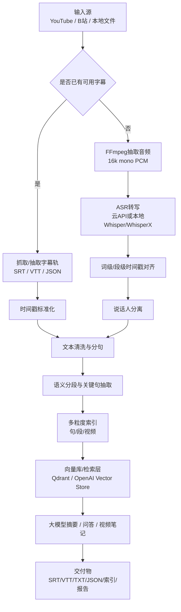

# 视频转文本并接入大模型的工程化管道研究报告

> **历史材料提示（2026-07-24）**
> 本文保留为早期广泛调研记录，正文中的 `turn…` 引用标记不可作为当前可点击证据，
> 部分模型能力、价格、部署方式和推荐也已变化。VtNote V1 的有效产品/技术基线以
> [产品需求](product-requirements.md)、[技术决策](technical-decisions.md)、
> [参考项目审计](reference-projects.md)、[一手来源与纠错](research-sources.md)和
> [需求追踪](traceability.md)为准；尤其应先阅读来源文档中的 COR-001 至 COR-006。

## 执行摘要

构建“让大模型理解视频”的文本管道，本质上不是单一的 ASR 任务，而是一个多阶段的时序信息工程：**输入接入、音频抽取、字幕优先获取、ASR 回退、时间戳对齐、文本后处理、语义增强、索引与 RAG 集成**，最后才是摘要、问答、笔记与检索等下游应用。对通用视频笔记与语义索引场景，最稳妥的总体策略是：**优先复用平台原生字幕，其次再做 ASR；优先保留词级或段级时间戳；后处理阶段显式保留视频级、段级、句级三层索引；在检索阶段将时间戳作为一等元数据写入向量库或倒排索引**。这样可以同时支持 B 站、YouTube、本地文件，以及带字幕和不带字幕的视频。YouTube 官方提供 caption track 的列举与下载能力，但下载要求对视频具有编辑权限；对公开视频，工程上常借助 `youtube-transcript-api` 或 `yt-dlp` 获取人工字幕或自动字幕。B 站方面，本报告**未找到面向第三方的通用官方字幕下载文档**；实践中普遍依赖页面公开接口或社区封装，因此应视为**非官方能力，需单独完成稳定性与合规验证**。citeturn22view0turn22view2turn22view3turn24search2turn19search6turn25search3

ASR 选型上，若目标是**快速原型**，云 API 最省工程成本；若目标是**低成本批量转写**，本地 Whisper/WhisperX 往往性价比最高；若目标是**企业级合规与可控性**，则更适合采用“自托管 ASR + 自建检索 + 云端或私有化大模型”的混合或全自托管路线。OpenAI Audio API 支持 `srt`、`vtt`、`verbose_json` 与 `diarized_json` 等输出，其中 `verbose_json` 支持 `word`/`segment` 粒度时间戳；Google Speech-to-Text V2 的 Chirp 系列支持多语言转写、词级时间戳、说话人分离和模型自适应；腾讯云录音文件识别支持字幕场景分段、词级时间戳、口语转书面语与角色分离；讯飞长音频转写支持词句时间戳、多发音人分离与热词；WhisperX 则在开源侧提供了**词级时间戳、forced alignment 与 speaker diarization** 的实用增强能力。citeturn14view1turn14view2turn14view3turn29view5turn29view6turn11view2turn11view1turn11view9turn37view0turn37view1

如果只给一个默认推荐，我建议按以下规则落地。**带字幕视频**：优先抓原字幕并保留原始时间码；**无字幕视频**：本地先用 WhisperX 做转写与强制对齐，再视需要叠加 pyannote 做说话人分离；**需要多语言与低集成风险**：选 Google STT V2 或 OpenAI Audio API；**中文长期批量、成本敏感**：优先评估讯飞或腾讯云 ASR；**强隐私/法务敏感**：把 ASR、向量库和检索层放到私有环境，云端仅保留可选的大模型总结层，或选择支持更严格数据控制的企业方案。OpenAI 官方说明，API 数据默认不用于训练，并提供数据控制与保留选项；中国场景还需遵守《个人信息保护法》，欧盟场景需考虑 GDPR。citeturn31search6turn31search11turn31search12turn26search1turn25search1

## 目标边界与输入假设

本报告假定你的目标是“**通用视频笔记与语义索引**”，并覆盖以下典型用例：为大模型扩展信息源、生成视频笔记、支持视频内检索与语义搜索、支持多平台来源与多语言视频处理。由于大模型的下游任务通常是“按事实区段问答、摘要、定位片段、生成学习卡片”，因此上游文本管道的核心产物不应只有纯文本，而应是**可回溯到时间轴的结构化文本**。WebVTT 明确把内容组织为与时间区间关联的 cue，并支持“时间对齐元数据”；SRT 也是以文本加时间码组织内容的通用字幕格式。换句话说，时间戳不是附属字段，而是下游检索与回看能力的基础。citeturn8search0turn8search1

输入范围建议明确分为四类。第一类是 **YouTube 在线视频**；第二类是 **B 站在线视频**；第三类是 **本地视频文件**；第四类是 **已有字幕文件与视频配对输入**。在工程实现上，前两类首先要处理“平台接入与字幕可得性”，第三类处理“流抽取与封装识别”，第四类则可以直接跳过 ASR，进入时间戳校验、清洗与索引环节。对于**带字幕视频**，优先处理原始字幕轨；对于**不带字幕视频**，则转入音轨抽取与 ASR。对于 **DRM、会员受限、私有分享、平台反爬限制、登录态要求、地域限制** 的内容，本报告将其标记为“**未指定/需另行处理**”，因为这些内容的访问方式直接受平台条款、授权和鉴权策略约束。YouTube 官方对 caption track 的下载要求用户对视频具有编辑权限；B 站用户协议同样要求用户按协议和法律使用服务。citeturn22view2turn25search2turn25search3

从目标架构看，这条管道至少要产出五类对象：**字幕文件**、**清洗后的全文文本**、**语义分段结果**、**索引载荷** 与 **给大模型用的检索切片**。如果只输出一份长文本，后续很难实现“跳回视频具体片段”“按人说话过滤”“只检索某一主题段落”“摘要时引用时间区间”等能力。因此，即便是最小可用版本，也建议在每个文本块中保留：`video_id`、`platform`、`language`、`start_ms`、`end_ms`、`speaker`、`source_type`、`segment_text`、`clean_text`、`asr_confidence` 或近似置信元数据。这个设计与向量检索中的“文本 + payload”结构天然兼容，而 OpenAI Retrieval 与 Qdrant 之类的向量检索系统都支持把文本作为索引对象并配套元数据进行检索或过滤。citeturn29view2turn29view3turn7search14

## ASR与字幕提取方案选型

### ASR 选型结论

如果先给结论，再解释原因，可以概括为三句话。**第一，字幕能取到就尽量不要重做 ASR**，因为原字幕通常具有更好的人工编辑质量和更稳定的分句。**第二，要高精度时间戳与开源可控，就优先 WhisperX 路线**，因为它把 Whisper 的泛化能力与 VAD、forced alignment、diarization 串起来了。**第三，要工程省心、多语言和企业支持，就优先云 API**，特别是 Google STT、腾讯云 ASR、讯飞长音频转写，以及 OpenAI Audio API。citeturn11view9turn29view5turn11view2turn11view1turn14view1

需要特别强调的是，**不同提供方公开的“准确率”并不直接可横向比较**。有的给 WER，有的给 CER/字准率，有的只说“提升准确率”，有的使用不同数据集、音频条件和语言。因此，下面表格中的准确率只能视为“公开口径/公开 benchmark 的参考”，不能当作严谨的同场景排名。真正上线前，仍然要用你自己的数据做 POC。Google 官方明确用 WER 作为测量口径；Whisper README 也说明不同语言的 WER/CER 差异很大；Vosk 则在模型页公开了按数据集划分的 WER；腾讯云 FAQ 给出的是第三方测试字准率而非 WER。citeturn34search3turn13view1turn17view2turn32search8

### 商用与开源 ASR 比较

| 方案 | 类型 | 公开准确率口径 | 语言覆盖 | 实时性 | 成本 | API/部署复杂度 | 模型/资源规模 | 离线能力 | 噪声鲁棒性 | 时间戳与说话人 | 推荐场景 |
|---|---|---|---|---|---|---|---|---|---|---|---|
| OpenAI `whisper-1` / `gpt-4o-transcribe` | 商用云 API | `whisper-1` 官方说明可做多语种转写，Whisper README 提示 WER/CER 随语言差异显著；`gpt-4o-transcribe` 面向更高质量转写，但当前引用页未给统一 WER | 多语言；`whisper-1` 为通用多语种模型 | 文件转写适合离线/批处理，实时转写另有 realtime 系列 | `whisper-1` 官方页为 **$0.006/分钟**；实时转写与实时翻译按分钟计费，价格因模型不同而异 | 低，HTTP API 直连即可 | 云端托管 | 否 | OpenAI 官方称新音频模型对真实世界噪声与静音幻觉有改进 | 支持 `srt`/`vtt`/`verbose_json`/`diarized_json`；`verbose_json` 支持词级和段级时间戳 | 快速原型、云端集成、要直接拿字幕格式输出 |
| Google Cloud STT V2 Chirp 2 / 3 | 商用云 API | 官方强调 **Chirp 2/3 提升准确率与速度**，但未在当前文档给统一单一 WER；Google 官方以 WER 为评估口径 | 官方页面称支持 **125+ languages**，并强调 85+ languages and variants 的转写支持 | 支持流式、短音频与 1 分钟到 8 小时批量识别 | 定价页显示动态批处理低至 **$0.003/分钟**，V1 标准模式高于此 | 中等，需要 Google Cloud 项目、鉴权和资源配置 | 云端托管 | 否 | 强，支持模型自适应与类/短语增强 | 支持词级时间戳、说话人分离、自动语言检测 | 企业级多语言、会议/播客/课程视频、要平台级 SLA |
| 腾讯云录音文件识别 / 大模型版 | 商用云 API | FAQ 给出第三方测试：**中文字准率 97.40%**、英文（美式）**不低于 88%**，但不构成承诺；另支持大模型版 | 当前产品页与国际站文档以中英场景最明确 | 适合实时与长音频异步识别 | 国际站示例为 **0.02 USD/分钟**；中文站有免费额度及大模型版单独计费 | 中等，API 参数较多 | 云端托管 | 否 | 官方支持过滤语气词、口语转书面语等增强 | 支持词级时间戳、字幕分段、口语转书面语、角色分离、情绪识别等增值项 | 中文会议、课程、法庭/质检类长音频，且要结构化输出 |
| 讯飞语音转写 / 实时听写 / 星火语音识别大模型 | 商用云 API | 长音频转写页未给统一量化指标；实时听写页宣传 **高达 98%**；转写页强调行业先进准确率与热词增强 | 实时语音听写页给出 **65 个语种、23 种方言和 1 个民族语言**；星火语音识别大模型页称支持 **37 个语种、202 种方言自动判别** | 强，既有实时也有长音频异步 | 长音频转写公开套餐约 **￥9.9/小时起**，量大更低 | 低到中等，中文文档完备 | 云端；另有私有化方向 | 部分私有化可选 | 对中文、方言、热词和格式规整友好 | 支持词句时间戳、多发音人分离、热词、格式化 | 中文与方言优先、教育/媒体/会议纪要场景 |
| Whisper 开源版 | 开源 | 官方 README 未给单一通用 WER，但给出按语言的 WER/CER 分解；大模型精度最高，小模型更快 | 多语言 | 取决于硬件；适合批处理 | 模型免费，主要成本是 GPU/CPU | 低到中等，安装最简单的开源 ASR 之一 | 官方 README 给出从 **39M 到 1550M** 参数；VRAM 约 **1GB 到 10GB** | 是 | Whisper 论文强调对口音、背景噪声和技术术语更鲁棒 | 原生可给段级时间戳；词级通常配合 WhisperX/对齐工具 | 预算敏感、需本地部署、希望开源可控 |
| WhisperX | 开源增强 | 论文与仓库强调面向长音频的更精确时间对齐与词级时间戳，不宜与云 API 的厂商指标直接比较 | 继承 Whisper 多语种能力 | 仓库称可实现 **70x realtime** 批处理；`large-v2` <8GB GPU 亦可运行 | 开源免费，算力成本自担 | 中等，依赖更多组件 | 依赖 Whisper + 对齐模型 + pyannote | 是 | 通过 VAD 降低静音幻觉 | 词级时间戳、说话人分离、forced alignment | 需要“时间戳质量”胜过“最省事”的工程方案 |
| Vosk | 开源 | 官方模型页公开多语言 WER；如英文大模型 **5.69 WER (LibriSpeech test-clean)**，中文大模型 **THCHS 7.43**、SpeechIO-02 **13.98** | 官方站称支持 **20+ 语言与方言** | 适合实时与轻量设备 | 免费 | 低 | 小模型约 **50MB**；大模型可达 GB 级且需高内存 | 是 | 官方强调轻量、离线、适配移动端；复杂噪声鲁棒性一般需自测 | 支持离线时间戳；适合轻量级需求 | 资源受限设备、树莓派、离线场景 |
| Kaldi | 开源框架 | 准确率取决于 recipe 和模型；官方 LibriSpeech Chain 模型可到 **WER 3.76% test-clean / 8.92% test-other** | 取决于训练语料与 recipe | 适合高可控部署与研究 | 免费 | 高，工程门槛最高 | 取决于模型 | 是 | 可通过定制声学/语言模型提升 | 可做对齐、图搜索、在线解码，但工程复杂 | 企业研究、自训练、极强可控性 |
| Silero STT / Silero VAD | 开源 | 官方 STT 页未给统一 WER；强调多语言、对噪声/方言/低采样率鲁棒 | “several commonly spoken languages”；VAD 轻量高效 | 很强，CPU 友好；VAD 单线程单块 <1ms | 免费 | 低 | VAD JIT 模型约 **2MB**；STT 小型化 | 是 | 适合作为前置切分与降噪辅助 | VAD 可返回时间戳；STT 本身更适合作为轻量组件 | 做前置 VAD、边缘设备、轻量离线流水线 |

表中数据综合自官方文档、官方模型页、官方仓库与原始论文；其中 OpenAI `whisper-1` 分钟价格来自官方模型页，Google 分钟价格来自官方定价页，腾讯/讯飞价格来自官方计费或产品页，Whisper 参数与 VRAM 来自官方 README，Vosk WER 来自官方模型页，Kaldi 的 WER 来自官方可下载模型页。citeturn38search12turn38search3turn14view1turn14view2turn37view0turn37view1turn34search15turn11view3turn32search8turn37view2turn33search0turn33search1turn33search7turn37view3turn13view1turn17view2turn18search9turn11view7turn9search0turn9search7turn11view9

### 字幕提取优先级与平台抓取方式

工程上建议把字幕获取顺序固定为：**平台原生字幕 > 视频内嵌字幕轨 > 社区工具抓取字幕 > ASR 回退**。YouTube 对内容所有者提供官方 caption track 的 list/download 接口，且可按原始格式或转换为 `srt` / `vtt` 下载；但官方下载接口要求用户对视频有编辑权限，因此它更适合“自己的频道”或内容管理方。对于公开视频，`youtube-transcript-api` 可以抓取人工字幕与自动字幕，而且不需要 API key 或 headless browser；`yt-dlp` 官方 README 也明确支持 `--list-subs`、`--write-subs`、`--write-auto-subs` 和字幕转换。citeturn22view1turn22view2turn22view3turn24search2

B 站的情况更复杂。基于本次调研，公开资料中更容易找到的是**社区项目对页面公开接口的封装**，而不是稳定的第三方官方字幕开放接口，因此更适合把它定义为“**非官方抓取链路**”。这并不代表不可做，而是意味着要把它纳入**变更监控、接口回归测试、登录态管理和法务评估**。如果你的业务对 B 站视频依赖很高，建议一开始就把 B 站链路封装成可替换 adapter，并准备“平台字幕失败则自动转 ASR”的回退逻辑。citeturn19search6turn25search3

可以把平台处理方式总结为下表：

| 来源 | 优先方法 | 备选方法 | 说明 |
|---|---|---|---|
| YouTube 自有视频 | YouTube Data API `captions.list` + `captions.download` | Studio 导出、平台内部流程 | 下载需要编辑权限，适合频道主/内容方 |
| YouTube 公开视频 | `youtube-transcript-api` | `yt-dlp --write-subs/--write-auto-subs` | 非官方，但工程实践成熟 |
| B 站公开视频 | 社区接口封装或社区 SDK | `yt-dlp`/页面 JSON/直接 ASR | 视为非官方能力，稳定性与合规需单独验证 |
| 本地文件 | 直接抽取内嵌字幕轨 | 无字幕则 ASR | 对文本字幕最友好，图片字幕需额外 OCR/识别链路 |

上表的关键依据是：YouTube 官方资源支持 caption track 列举与下载；`youtube-transcript-api` 明确支持自动字幕与翻译；`yt-dlp` 明确支持人工字幕和自动字幕；B 站更多依赖社区封装。citeturn22view0turn22view2turn22view3turn24search2turn19search6

## 时间戳、后处理与语义增强

### 音轨与字幕轨抽取

本地视频建议统一先做一次“流探测”，然后决定是抽音轨还是抽字幕轨。FFmpeg 官方文档说明了 `-map` 的流选择语法、`-codec copy` 的无损复制模式，以及音频、字幕流的单独选择方式。实践中最常用的两条命令如下。

```bash
# 提取 ASR 友好的单声道 16k PCM 音频
ffmpeg -i input.mp4 -vn -ac 1 -ar 16000 -c:a pcm_s16le out.wav

# 直接无损拷贝第一路音频
ffmpeg -i input.mp4 -map 0:a:0 -c:a copy out.m4a
```

如果文件本身内嵌了文本字幕流，也可以先直接抽轨：

```bash
# 抽取第一路字幕轨
ffmpeg -i input.mkv -map 0:s:0 -c:s copy out.vtt
```

但要注意，FFmpeg 文档同时指出字幕流可能是**图像型字幕** 而非文本型字幕；这类字幕流可以被 copy 出来，却不等价于可直接送入 LLM 的文本。也就是说，“抽出字幕轨”不等于“拿到可检索文本”。citeturn21view0

### 带时间戳字幕文件的生成与精度保障

SRT 是通用性最强的交换格式，WEBVTT 则更适合 Web 与富元数据场景。W3C 规范明确指出 WebVTT 是由与时间区间关联的 cue 组成，并可用于时间对齐元数据；Library of Congress 也将 SRT 列为最通用的字幕文本格式之一。OpenAI Audio API 可以直接输出 `srt`、`vtt` 或 `verbose_json`；`verbose_json` 还能给出 `word` 和 `segment` 粒度时间戳。Google Chirp 2/3 与腾讯云、讯飞也支持不同程度的词级或句级时间戳。citeturn8search0turn8search1turn14view1turn14view2turn11view2turn11view1turn37view0turn37view1

如果你关心“字幕文件是否真正适合检索与引用”，建议把时间轴精度拆成三层来保证。第一层是**输入一致性**：统一到单声道、16kHz PCM，避免不同封装和采样率造成的时间基不一致。第二层是**模型侧时间戳**：优先使用词级时间戳或强制对齐结果，而不是只依赖段级粗时间戳。OpenAI 官方指出，词级时间戳会增加额外延迟；WhisperX 则专门用 wav2vec2 alignment 提供更准确的词级时间戳，并通过 VAD 预处理降低幻觉。第三层是**后校准**：如果字幕与视频整体存在前后偏移，可用 ffsubsync 做语言无关的自动同步；若是长视频中的局部漂移，则需要重切分或重新对齐，而不仅仅是整体平移。citeturn14view1turn11view9turn6search1turn6search8

### 文本清洗、分段、说话人分离与错误纠正

后处理的目标不是“把 ASR 文本修得像文章”，而是“让文本既可读、又能检索、还能回到视频原片段”。因此建议把后处理分成四步。

第一步是**清洗**。包括：统一标点、去重叠字、清除口头禅或语气词、合并断裂数字/日期表达、保留时间码和说话人标签。腾讯云直接提供口语转书面语和口语词过滤类增值能力；讯飞长音频转写也支持标点预测、数字/日期/时间格式规整。对中文分句和句法感知切分，可以用 HanLP 做句子边界与分词；HanLP 官方文档也强调许多模型的输入是句子级而非整篇文档。citeturn11view2turn33search0turn36search3turn36search4

第二步是**分段**。比较稳妥的顺序是：先按 VAD 或平台句段时间戳得到粗切片，再按句法与标点调整边界，最后按语义相似度合并或拆分。Silero VAD 提供轻量、CPU 友好的说话片段检测，还能输出时间戳；WhisperX 也把 VAD 放在前处理链上。对于中文，单纯按固定秒数切块并不理想，建议至少尊重句子边界；HanLP 或规则分句器都能帮助避免把一句话硬切成两半。citeturn9search0turn9search7turn11view9turn36search4turn36search15

第三步是**说话人分离**。如果你的下游要做“谁说了什么”“按老师/学生过滤”“会议纪要按角色汇总”，就不应把 diarization 当作可选项。pyannote.audio 是目前开源生态里最主流的 diarization 工具包之一；Google STT 和 OpenAI 也提供说话人标注能力，Google 会给词附加 speaker 标签，OpenAI 的 `gpt-4o-transcribe-diarize` 则要求使用 `diarized_json` 输出。腾讯云还提供角色分离等增值能力。citeturn29view4turn29view5turn14view3turn14view4turn37view2

第四步是**错误纠正与语义增强**。在通用场景下，最有效的不是“全文交给 LLM 生造修订版”，而是**有限约束纠错**：只允许修正术语、数字、拼写、专名和断句，且必须保留时间戳边界。Google STT 的 model adaptation 明确支持短语集、类 token 与 boost；Vosk 也支持小模型的动态词汇重配置；讯飞支持个性化热词。关键词抽取可以用 KeyBERT；句间相似度、聚类与语义合并可用 Sentence Transformers；抽取式摘要可以从 TextRank/LexRank 起步，资源少时比直接上大模型更便宜、更稳。citeturn29view6turn29view7turn17view2turn33search0turn35search1turn35search21turn35search11turn35search3turn35search14

工程上建议至少建立三层索引单元。**句级索引**用于精确跳转，**段级索引**用于主题检索与问答，**视频级索引**用于全局摘要、标签与课程/章节归档。不要只存一层。多粒度索引能够明显改善“短问句命中细粒度片段”和“长问题命中主题段”的冲突。OpenAI embeddings 文档说明向量嵌入用于搜索、聚类与分类；Qdrant 则明确把自己定位为语义搜索引擎。citeturn29view1turn29view3

## 与大模型集成的方法

### 喂给大模型的正确对象

不建议直接把整份全文字幕一次性喂给大模型。更好的输入对象是：**带时间戳的语义分段 + 层级元数据 + 可追溯原文**。OpenAI embeddings 文档指出嵌入建模的是文本之间的相关性，适合搜索、聚类和推荐；OpenAI Retrieval 则直接把向量库定义为索引层。因此，你真正送入 LLM 的最好不是“视频全文”，而是“**召回出的若干最相关片段**”。citeturn29view1turn29view2

分块策略建议按两个边界同时控制：一是**语义完整性**，二是**模型 token 上限**。OpenAI embeddings 接口说明单个 embedding 输入有 token 上限，因此长字幕必须先切块；如果你还要做二次总结，就应该保留“原始块”和“摘要块”两套索引，把高频检索放在原始块，把大范围浏览放在摘要块。这样能同时降低成本与延迟。citeturn7search18turn29view1

### 典型 RAG 设计

一个实用的视频 RAG 流程通常如下：用户发问后，先走**视频级粗召回**，确定候选视频；接着做**段级向量召回**，取回几个相关片段；必要时再做**句级再排序**，最后把片段连同时间戳、说话人和来源平台一起送入大模型生成答案。这样大模型既能“回答”，又能“指出在哪一段视频里”。OpenAI Retrieval API 已提供向量库与搜索接口；如果你要自建，则 Qdrant 是很直接的向量检索底座。citeturn29view2turn7search14turn29view3

提示工程上，建议把指令写成“**只基于检索片段回答；若证据不足就明确说明；输出每条结论对应的时间区间**”。对摘要任务，则建议用“**先段内摘要，再视频级汇总，再生成关键结论/问题/行动项**”的层级式提示，而不是把 2 小时视频一次塞进模型；这样更稳定，也更容易控制成本。

### 示例 API 流程

下面给一个“云转写 + 向量索引 + 问答”的最小流程示意。第一步直接把音频转成带词级时间戳的 JSON：

```bash
curl https://api.openai.com/v1/audio/transcriptions \
  -H "Authorization: Bearer $OPENAI_API_KEY" \
  -H "Content-Type: multipart/form-data" \
  -F file="@./audio.mp3" \
  -F model="whisper-1" \
  -F response_format="verbose_json" \
  -F "timestamp_granularities[]=word"
```

这类调用在官方文档中是明确支持的，返回的 `words` 数组包含 `word`、`start`、`end` 字段。citeturn14view0turn14view1turn14view2

接着做嵌入与索引：

```python
from openai import OpenAI

client = OpenAI()

chunks = [
    {
        "text": "今天我们讨论检索增强生成……",
        "video_id": "yt_xxx",
        "start_ms": 120000,
        "end_ms": 156000,
        "speaker": "SPEAKER_01",
        "platform": "youtube",
    }
]

vectors = client.embeddings.create(
    model="text-embedding-3-small",
    input=[c["text"] for c in chunks]
)

# 然后把 vector + payload 写入 Qdrant / OpenAI vector store
```

OpenAI 官方文档明确给出了 embeddings 与 vector store 的工作方式；如果你不想自己搭建向量库，也可以直接用 OpenAI Retrieval / vector stores 做原型。citeturn29view1turn29view2turn7search6

本地方案也可以非常直接。下面是一个“本地 WhisperX + pyannote + JSON 输出”的简化示意：

```python
import whisperx

audio_file = "out.wav"
device = "cuda"
model = whisperx.load_model("large-v2", device=device, compute_type="float16")

audio = whisperx.load_audio(audio_file)
result = model.transcribe(audio, batch_size=16)

align_model, metadata = whisperx.load_align_model(language_code=result["language"], device=device)
aligned = whisperx.align(result["segments"], align_model, metadata, audio, device)

# 如果需要说话人分离，再叠加 diarization pipeline
# diarized = diarize(audio_file)
# final = assign_word_speakers(diarized, aligned)
```

WhisperX 官方仓库明确说明其优势在于词级时间戳、说话人分离和面向长音频的高吞吐转写。citeturn11view9turn7search12

## 系统架构、部署与实现方案

### 端到端流水线设计

下面给出一个建议的端到端流程图。它体现了一个关键原则：**字幕优先，ASR 回退，索引与大模型解耦**。这样做的好处是任何一个环节都能独立替换，而且平台适配不会污染 ASR 核心链路。



这套设计之所以稳定，是因为 FFmpeg 擅长流处理，ASR 负责把声学信号转成文本，WhisperX / pyannote / 平台词级时间戳负责时间对齐与说话人，向量库负责检索，大模型只做“基于检索结果的理解和生成”。FFmpeg 官方文档覆盖了流选择、复制和字幕流处理；WhisperX、pyannote、OpenAI Retrieval 与 Qdrant 分别覆盖对齐、说话人分离、检索与向量存储。citeturn21view0turn11view9turn29view4turn29view2turn29view3

### 组件接口与并发容错

实际工程中，建议把组件接口固定为三类 JSON。第一类是 **Asset Manifest**，记录原视频 URL、平台、文件哈希、下载状态、字幕可得性。第二类是 **Transcript JSON**，记录 `words[]`、`segments[]`、`speaker[]`、`language`、`duration`。第三类是 **Index Payload**，记录切块文本与时间元数据。这样一来，失败重试可以按阶段做：抓字幕失败只重跑抓取，不必重跑 ASR；ASR 失败只重跑转写，不必重建索引；摘要失败也不会影响底层检索资产。

并发上，推荐采用“**视频级任务队列 + 阶段级幂等存储**”。长视频应优先拆成章节或固定片段再并行，而不是把 3 小时文件作为单任务长时间占住资源。WhisperX 仓库给出批处理与显存要求信息；Google STT V2 则把短音频、流式和 1 到 8 小时长音频的适用方法明确区分开。citeturn11view9turn37view0

### 三种实现方案对比

| 方案 | 技术组合 | 适合谁 | 成本 | 复杂度 | 准确性 | 可维护性 | 备注 |
|---|---|---|---|---|---|---|---|
| 快速原型 | 平台字幕抓取 + OpenAI Audio API / Google STT + OpenAI Vector Store + LLM 摘要 | 想尽快验证产品价值 | 中 | 低 | 中到高 | 高 | 交付最快，最适合 PoC |
| 混合方案 | 平台字幕抓取 + 本地 WhisperX/pyannote + 云大模型总结与问答 + Qdrant | 有一定工程能力且想压低 ASR 成本 | 中低 | 中 | 高 | 中高 | 精度、成本、可控性平衡最好 |
| 企业级 | 自托管 ASR/Kaldi/WhisperX + 自建对象存储 + Qdrant/ES + 私有化或企业级 LLM | 强合规、强隐私、长期运营 | 初期高、长期可控 | 高 | 高 | 高 | 最适合内网/专有数据与法务敏感场景 |

这个比较建立在前述事实之上：OpenAI、Google、腾讯云、讯飞都提供云侧语音能力；Whisper/WhisperX/Vosk/Kaldi/pyannote 支持本地化部署；Qdrant 明确支持语义搜索；OpenAI Retrieval 适合快速原型。citeturn38search3turn11view3turn37view2turn37view3turn11view9turn17view2turn18search9turn29view4turn29view3turn29view2

### 关键命令与代码建议

如果你的实现目标是优先“稳”，建议先把下面几组命令或脚本固化成 CLI。

YouTube 获取字幕：

```bash
# 先看有哪些字幕轨
yt-dlp --list-subs "https://www.youtube.com/watch?v=VIDEO_ID"

# 下载人工字幕与自动字幕，转换为 srt
yt-dlp --skip-download \
  --write-subs --write-auto-subs \
  --sub-langs "zh.*,en.*" \
  --convert-subs srt \
  "https://www.youtube.com/watch?v=VIDEO_ID"
```

`yt-dlp` 官方 README 明确支持字幕列举、人工字幕与自动字幕抓取。citeturn24search2turn24search8

本地 Whisper CLI：

```bash
whisper out.wav --model turbo --language Chinese --output_format srt
```

Whisper 官方 README 给出了命令行与 Python 调用方式，并说明 `turbo` 更适合英文快速转写，翻译则更推荐 `medium` 或 `large`。citeturn13view2turn13view4

## 评估、合规与交付物

### 评估指标与测试流程

ASR 质量的主指标仍然是 **WER/CER**。Google 官方博客明确说明其使用 WER 作为 STT 评估口径；NIST 的 SCTK/SCLITE 是语音识别评测的标准工具链之一。对中文场景，通常还要同时看 **CER**，因为中文没有天然的空格分词边界。若你的下游重点是术语、数字、专有名词，则还应单独统计这些“关键 token” 的错误率，因为它们对笔记和检索影响最大。citeturn34search3turn27search3turn27search7

时间戳准确性建议独立评测，不要被 WER 掩盖。一个文本完全正确但时间戳漂移 5 秒，仍然会严重影响“跳转回视频”和“检索命中该片段”的体验。实践中可以人工标注一小批黄金集，对比词或句的开始/结束边界，统计平均绝对误差与超阈值比例；若做字幕交付，则还应人工抽查“换行位置”和“语义断点是否自然”。

下游任务评估至少分两类。**摘要任务** 看事实覆盖率、幻觉率与时间区间引用正确率；**检索任务** 看 Recall@k、MRR、nDCG 以及“命中后能否回到正确视频时间段”。如果要评估 embedding 或检索模型本身，可参考 MTEB 这类嵌入评测基准；该基准覆盖 58 个数据集和 112 种语言，适合做模型层的初步筛选。citeturn29view0

测试集建议采用“**公开基准 + 业务自建集**”双轨。公开层面，多语种可以参考 Common Voice 与 FLEURS；中文可关注 SpeechIO、THCHS 一类数据集；而真正影响你上线体验的，通常还是“你自己的视频语料”，例如课程录屏、访谈、播客、直播回放、B 站知识视频等。Whisper README 明确提到其在 Common Voice 15 和 Fleurs 上给出按语言的 WER/CER；Vosk 模型页则直接给出了 SpeechIO 与 THCHS 的结果。citeturn13view1turn17view3

一个可执行的实验流程可以是：先抽样 30 到 50 个视频，覆盖平台、语言、字幕有无、噪声水平和说话人数量；然后对比三条链路：**平台字幕**、**云 ASR**、**本地 WhisperX**。输出统一格式 JSON，再用同一套脚本评测 WER/CER、时间戳偏差、召回效果和摘要可用性。这个流程比只看某一个厂商宣传页更能反映真实决策价值。citeturn34search3turn11view9turn22view0

### 隐私、版权与合规建议

视频文本化天然涉及三类风险：**版权、个人信息、平台条款**。版权层面，YouTube 官方条款强调用户只能按服务提供方式和协议使用内容；YouTube 官方 captions 下载接口也要求对视频具有编辑权限，这说明“技术上可抓”不等于“法律上可自由下载和复用”。B 站同样有用户协议约束。因此，对非自有内容，建议把用途限制在已授权、内部研究、内容分析或符合法律例外的场景，并保留授权与处理记录。citeturn25search2turn22view2turn25search3

隐私层面，音视频中经常包含姓名、电话、邮箱、位置信息与敏感言论。中国场景至少要考虑《个人信息保护法》关于个人信息处理和敏感信息处理的要求；欧盟场景要考虑 GDPR。工程上最有效的措施不是只写制度，而是把制度落到流水线里：默认最小化保留原始音频，优先存文本和时间戳；对对话内容做脱敏；按项目设置数据保留周期；把“向云供应商发送原音频”变成显式开关，并区分开发环境与生产环境。citeturn26search1turn25search1

如果使用 OpenAI 等云供应商，还要理解数据控制边界。OpenAI 官方说明 API 数据默认不用于训练，并提供数据控制与零数据保留选项给符合条件的组织；企业文档也说明可配置业务数据保留策略。对于严格合规场景，这意味着你应优先使用 API 而非个人产品，并在采购与法务阶段确认保留策略、区域处理、DPA、日志留存和密钥管理能力。citeturn31search6turn31search11turn31search12turn31search0

### 交付物建议

建议把交付物分成“数据资产”“代码资产”“运维资产”三层，而不是只交一份脚本。

数据资产层建议至少包含以下内容：

- `*.srt` / `*.vtt` 字幕文件  
- `transcript.json`，包含词级/段级时间戳、说话人、语言、来源  
- `cleaned.txt` 或 `cleaned.jsonl`，包含清洗后文本  
- `segments.jsonl`，包含多粒度分段结果  
- `summary.md`，包含视频级摘要、关键句、行动项与时间区间  
- `index_payload.jsonl`，可直接导入向量库或搜索引擎

代码资产层建议至少包含以下内容：

- 平台 adapter：YouTube、B 站、本地文件  
- 音频抽取脚本与 FFmpeg 命令模板  
- ASR 适配层：OpenAI / Google / 腾讯 / 讯飞 / WhisperX  
- 后处理模块：清洗、分段、对齐、说话人分离、纠错、摘要  
- 索引构建脚本：Qdrant / OpenAI vector store / 其他检索后端  
- API 示例与最小端到端 demo

运维资产层建议至少包含以下内容：

- `docker-compose.yml` 或 Kubernetes 部署清单  
- 配置模板：模型路径、API key、并发限制、重试策略  
- 任务队列与失败重试策略说明  
- 监控项：转写耗时、失败率、WER 抽样、索引大小、召回命中率  
- 架构图与数据流图  
- 合规说明：授权边界、数据保留、脱敏策略、第三方服务列表

如果必须给“最小可交付版本”，那也至少应交付：**SRT/WEBVTT、清洗文本、分段摘要、索引文件、部署脚本、架构图**。这样才真正能支撑后续的大模型问答、视频笔记和语义搜索。
