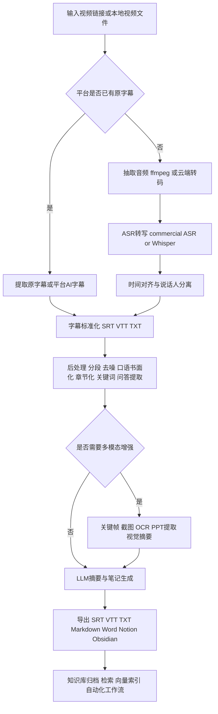

# 现有将视频链接或视频文件转成可供大模型理解的字幕、笔记与摘要工具研究报告

> **历史材料提示（2026-07-24）**
> 本文保留为早期市场扫描，不再作为 VtNote V1 的价格、版本、供应商能力或实现范围
> 依据。正文中的 `turn…` 引用标记未完成可点击来源审计，Videosays 旧价格、
> AssemblyAI 自托管和 OpenAI 模型输出格式等陈述已有明确更正。请以
> [产品需求](product-requirements.md)、[网站规格](website-specification.md)、
> [参考项目审计](reference-projects.md)、[一手来源与纠错](research-sources.md)和
> [需求追踪](traceability.md)为准。

## 执行摘要

当前市场上，真正成熟的“视频转可供大模型理解的文本”方案，已经明显分成三层：第一层是面向个人用户的“贴链接即得结果”产品，代表是 BibiGPT、Videosays、NoteGPT；第二层是面向会议、培训、课程与企业文件管理的 SaaS，代表是飞书妙记、通义听悟、讯飞听见；第三层是面向开发者和企业平台化集成的 API 或本地化流水线，代表是 OpenAI Audio API 与 Whisper 系、AssemblyAI、Deepgram、WhisperX/faster-whisper。三层方案的差异，不在“能不能转文字”，而在于能否处理中国平台链接、是否优先利用原字幕、时间戳精度、后处理能力、以及最终能否把结果转成结构化知识。citeturn35view0turn37search8turn5search3turn5search1turn10search1turn11search1turn12search0turn8search2

如果你的核心目标是“让大模型理解视频”，最有效的工程路线并不是直接把视频扔给模型，而是先做“字幕层”与“结构层”的标准化：优先提取平台已有字幕；没有字幕时，再走音频抽取、ASR 转写、时间对齐、说话人分离、章节切分、关键词/问答/要点提炼，最后再交给大模型做摘要、笔记和重写。这个判断得到了多个成熟工具的产品设计印证：BibiGPT 已经在 B 站上直接使用平台原生 AI 字幕，Videosays 直接返回 transcript/timeline/SRT/VTT，通义听悟和 AssemblyAI/Deepgram 则把章节、总结、问答、主题识别作为转写后的标准后处理能力。citeturn35view2turn37search9turn36search0turn34view2turn11search9turn12search2turn12search3

如果按场景给出最简选择，个人知识管理优先推荐 BibiGPT；中国短视频平台链接批量抽取优先推荐 Videosays；课程、会议与培训资料整理优先推荐通义听悟或飞书妙记；要做企业级批量处理与自动化，优先看 Deepgram、AssemblyAI 或 OpenAI Audio API；对隐私最敏感、希望本地可控，则应优先考虑 AI-Media2Doc、WhisperX/faster-whisper，以及本地 LLM 的组合。需要特别强调的是，多数西方工具对 YouTube 与本地上传支持成熟，但对小红书、抖音、快手、B 站等中国内容平台的直接链接支持，仍主要集中在 BibiGPT、Videosays 这类专做跨平台媒体理解的产品上。citeturn35view0turn37search8turn37search9turn5search1turn5search3turn12search0turn11search1turn10search1turn29view0turn8search2

## 市场格局与关键判断

最值得先看清的一点是，“平台支持”这件事并不等于“官方 API 支持”。BibiGPT 在官网明确写明支持 YouTube、B 站、TikTok、抖音、快手、小红书、X、Vimeo、TED、Coursera、播客以及本地音视频与字幕文件；Videosays 也明确支持 Douyin、TikTok、YouTube、Bilibili、Xiaohongshu、Kuaishou、Instagram、X、微信视频号等公开链接，并强调前提是“公开可访问”。这说明，面向中国视频平台的成熟产品路线，通常是“分享链接/公开页抓取 + 字幕或音频提取”，而不是面向开发者稳定开放的官方内容 API。对实际落地而言，这意味着你不应该把这类平台接入能力当成永久稳定接口，而应当视作“高价值但需容错”的内容采集层。citeturn35view0turn13search14turn37search8turn37search9

第二个关键判断是，成熟产品已经不满足于“输出一整段逐字稿”，而是把“结构化知识”作为核心卖点。通义听悟把章节速览、全文摘要、发言总结、问答对提取、待办事项、关键词、口语书面化，以及视频 PPT 抽取与摘要都做成了标准能力；飞书妙记强调时间戳、发言人、智能纪要、待办提炼与多格式导出；讯飞听见则把区分说话人、AI 纪要、语篇规整、思维导图等做成了面向办公的高频功能。也就是说，市场已经从“ASR 工具”进入“ASR + 分析 + 知识化输出”的阶段。citeturn34view2turn33view2turn32search1turn32search2turn32search8turn32search11

第三个关键判断是，多模态能力仍然稀缺，但已经开始成为差异化竞争点。BibiGPT 的视觉摘要页面明确强调“AI 真正看视频画面”，可识别 slides、charts、on-screen demos 和 key scenes，并生成图文摘要；其更新记录还明确加入了 PPT 抽取、硬字幕 OCR、本地隐私模式。通义听悟则在官方发布记录中明确提供了“视频 PPT 抽取及摘要”。相比之下，大多数开发者 API 平台仍然是“强音频、弱画面”，例如 OpenAI Audio API、AssemblyAI、Deepgram 仍以语音到文本与音频 intelligence 为主。citeturn35view1turn21search4turn34view2turn10search1turn11search1turn12search2

第四个关键判断是，准确率宣传不能脱离语境看。飞书妙记、讯飞听见、Trint、TurboScribe 等产品页面都给出了 98% 到 99% 的高准确率表述，但它们往往对应清晰音频、标准发音、特定语言或厂商自选测试集；不同产品是否支持说话人分离、是否带时间对齐、是否做过口语规整、是否对行业热词优化，也会显著影响你看到的“最终效果”。因此，真正能用于采购或选型的，不是单看一个准确率数字，而是看清你的内容类型究竟是课程、访谈、多人会议、短视频脚本、还是截图密集的 PPT 讲解。citeturn33view2turn32search11turn4search20turn39search2turn8search2

作为补充观察，市场上还有一批值得关注但不一定适合作为“主工作台”的产品。TurboScribe 在文件上传、多语言、字幕导出与性价比上非常强，支持 YouTube 链接、批量导出 DOCX/PDF/TXT/SRT/VTT、说话人识别与 10 小时/5GB 大文件；VideoLingo 则更偏向“字幕翻译与本地化生产”，以 WhisperX、AI 分段、可接 Ollama 的本地方案见长；Trint 则在新闻编辑与合规场景较成熟，公开强调 ISO 27001、EU/US 数据存储和端到端加密。它们都很成熟，但和“把中国平台内容快速转成知识笔记”的主诉求相比，重心略有不同。citeturn39search16turn39search12turn39search17turn14search0turn14search12turn22search7turn22search10turn22search16

## 重点工具对比表

| 工具 | 入口与平台支持 | 转写引擎与时间戳 | 摘要、笔记与多模态 | 集成、隐私、定价 |
|---|---|---|---|---|
| **BibiGPT** | 贴链接即可处理 YouTube、B 站、抖音、小红书、快手、播客等，亦支持 mp3/mp4/srt/vtt/ass 本地文件。 | 对 B 站已支持直接利用平台原生 AI 字幕；也支持字幕提取、视频转文字、时间线与多模型理解。 | 支持总结、思维导图、AI 追问、改写，并可保存到 Notion、Obsidian、flomo；视觉摘要可识别 slides/charts/demo/key scenes；有本地隐私模式。 | Web、桌面端、浏览器扩展、CLI/Skill；支持本地运行隐私模式；免费试用，订阅与 credit 模式并存。 citeturn35view0turn35view1turn35view2turn35view3turn19search0 |
| **Videosays** | 支持公开可访问的 Douyin、TikTok、YouTube、Bilibili、小红书、快手、微信视频号等链接。 | 面向“视频链接转 text/timeline/SRT/VTT”；官方以异步任务返回 transcript、timeline、SRT、VTT。 | 强项是把短视频或平台视频快速转成可复用文本，便于后续摘要、改写、脚本分析；多模态画面理解不是核心卖点。 | Web、CLI、REST API、AI Agent Skill；免费 5 分钟，按余额付费，Trial ¥8/30 分钟，Starter ¥18/100 分钟。 citeturn13search14turn36search0turn37search8turn37search9turn37search6turn37search0 |
| **NoteGPT** | 以 YouTube 与本地音视频为主，支持批量处理 YouTube 视频与频道总结。 | 付费页明确区分“有字幕的 YouTube”和“无字幕的 YouTube”，说明其会优先使用已有字幕，缺字幕时再走更重的转写流程。 | 强项在摘要、思维导图、学习型笔记与频道级总结；对中国视频平台的直接支持不如 BibiGPT/Videosays 明确。 | Web/SaaS；Pro/Unlimited/Max 套餐清晰，年付折算约从 $9/月起。 citeturn18view2turn38view1turn38view2 |
| **飞书妙记** | 会议内置转写，也支持音视频资料整理；更适合企业会议、培训、访谈。 | 支持时间戳、发言人识别、SRT 导出；官方材料称中文通用场景可达 98%+，支持粤语、川语等 10 余种方言。 | 智能纪要可自动提炼决策、行动项、待办人与截止时间，并可同步飞书文档或日历。 | 桌面端、Web、飞书生态深集成；支持权限设置、禁止下载、水印等；基础版提供一定体验额度。 citeturn5search3turn5search5turn33view2turn5search12 |
| **通义听悟** | 支持本地上传、阿里云盘导入、网站/小程序、API 接入。 | 支持多语言识别、区分发言人、章节切分；对中英日韩粤自由说支持较强，还支持自动语种识别。 | 功能最完整之一：全文摘要、章节速览、发言总结、问答提取、关键词、待办、口语书面化、思维导图、视频 PPT 抽取与摘要。 | Web、小程序、API；可导出原文、笔记、音视频和译文；价格公开为转写 0.6 元/小时，大模型能力通常 0.22 元/小时/项，PPT 抽取 0.8 元/小时。 citeturn5search1turn5search4turn34view2turn5search13 |
| **讯飞听见** | 支持实时录音、上传音视频、企业 API；更偏办公、采访、课堂、会议。 | 官方称 1 小时音频最快 5 分钟出稿，普通话准确率最高 98%；支持 11 国语言与大量中文方言，并支持区分说话人。 | 支持 AI 纪要、语篇规整、说话人总结、标注、打点回溯；适合把会议内容再包装成结构化纪要。 | Web、桌面端、App、企业服务/API；价格可按 0.33 元/分钟机器快转，亦可按会员套餐购买时长。 citeturn6search2turn32search1turn32search11turn32search8turn7search2turn7search3 |
| **AI-Media2Doc** | 以本地部署和本地文件处理为主，适合上传音视频做二次创作。 | 当前强调“音视频转各种风格文档”，可导出字幕文件；项目未来计划支持 fast-whisper 本地 ASR。 | 最大亮点是把音视频转成小红书、公众号、知识笔记、思维导图、总结等风格文档，并支持智能截图插入文章。 | MIT 开源、Docker 一键部署、任务记录保存在本地、无需登录注册；很适合自建知识工厂。 citeturn29view0 |
| **OpenAI Audio API 与 Whisper 系** | 适合上传文件或流式音频的 API 场景；视频链接需自行抓取音频后调用。 | OpenAI Audio API 已支持 `gpt-4o-transcribe`、`gpt-4o-mini-transcribe`、`gpt-4o-transcribe-diarize`；开源 Whisper 支持多语言转写与翻译，WhisperX 可进一步补全词级时间戳与说话人分离。 | 原生更偏“高质量转写与可编程性”，视频画面/PPT/OCR 需自行补链到视觉模型。 | 典型开发者方案；价格公开为 gpt-4o-transcribe 约 $0.006/分钟、mini 约 $0.003/分钟；Whisper 开源可本地部署。 citeturn10search1turn10search0turn9search1turn9search9turn8search2 |
| **AssemblyAI** | API 优先，适合企业异步批处理、流式处理和二次开发。 | Universal-3.5 Pro 支持 18 语言与更强说话人分离；Universal-2 支持 99 语言；提供词级时间戳、speaker diarization、custom spelling 等。 | 有 Auto Chapters、Summarization、LeMUR 等能力，适合把长音频/视频转成可查询、可问答、可章节化的知识。 | 开发者平台成熟，安全合规公开较全；价格公开为 Universal-2 $0.15/小时，speaker diarization +$0.02/小时，summarization +$0.03/小时。 citeturn11search1turn11search9turn11search10turn23search7turn23search10 |
| **Deepgram** | API 优先，也提供官方 CLI 和 self-hosted 能力。 | Nova 系列支持 45+ 语言、说话人分离、smart formatting、keyterm prompting、自动语言检测。 | Audio Intelligence 包括 Summarization、Sentiment、Topic Detection、Intent 等，适合批量媒体内容理解。 | 提供 $200 免费 credit；官方 CLI 可直接转写文件与 URL；支持 SOC 2/HIPAA/self-hosted。公开媒体客户包括 VEED、Wistia、Wisecut、Zubtitle、Syncwords。 citeturn12search0turn12search2turn12search3turn12search10turn22search5turn22search19turn12search8 |
| **WhisperX 与 faster-whisper** | 适合你自己控制下载、音频抽取和本地推理的开源流水线。 | WhisperX 明确主打词级时间戳与 speaker diarization，且宣传 large-v2 可达约 70x realtime；原始 Whisper 也支持多语言与翻译。 | 本身不做知识笔记，但和任意 LLM 组合后，非常适合作为“字幕标准化底座”。 | 多数场景可本地运行，隐私、成本、可控性最佳；缺点是需要自己搭 URL 抓取、批处理、存储和摘要层。 citeturn8search2turn9search1turn9search12 |

从这张表可以看出，若只比较“贴链接处理中国平台视频”，BibiGPT 与 Videosays 的成熟度最突出；若只比较“上传文件转写并自动形成会议/课程纪要”，通义听悟、飞书妙记、讯飞听见更完整；若只比较“面向二次开发与批量自动化”，Deepgram、AssemblyAI、OpenAI Audio API 更稳；若只比较“隐私与本地可控”，WhisperX/faster-whisper 与 AI-Media2Doc 的组合最有优势。citeturn35view0turn37search8turn5search1turn5search3turn32search0turn12search0turn11search1turn10search1turn29view0turn8search2

## 每个候选工具的简短评估

**BibiGPT** 的最大优势，是它把“跨平台链接输入”和“结果知识化输出”放在同一个界面里做完：支持 B 站、YouTube、抖音、小红书等平台链接，也能接本地字幕和音视频文件。它不是只给你逐字稿，而是给总结、思维导图、AI 问答、知识库导出，甚至还能把画面里的 slide、chart 和关键场景做成图文摘要。弱点在于它的部分高级能力和价格细节带有较强产品化包装，企业级 SLA、可观测性和开放接口深度，仍不如开发者 API 平台。citeturn35view0turn35view1turn35view2turn35view3

**Videosays** 很适合“我先要把短视频和平台视频变成文本，再喂给别的 AI”这类工作流。它对中国短视频平台的覆盖很实用，且 Web、CLI、REST API、Agent Skill 四套入口都比较完整，说明它不仅是一个网页工具，也是一个自动化部件。它的不足是多模态与知识整理仍偏“下游交给别的模型做”，也就是说它更像稳定的“采集与字幕层”，而不是完备的“研究笔记工作台”。citeturn36search0turn37search8turn37search9turn37search0

**NoteGPT** 的优势是非常适合 YouTube 学习、课程视频和“频道级总结”。其定价页面已经能看出它对“已有字幕”和“无字幕视频”做了差异化处理，也支持本地音视频上传，这意味着它会优先利用原始字幕，缺字幕时再走更贵的处理路径。它的问题在于，对中国平台支持不够突出，若你的核心资源在 B 站、抖音、小红书，它通常不是第一选择。citeturn18view2turn38view1turn38view2

**飞书妙记** 最强的地方不是“转写本身”，而是它和组织协作场景天然整合：时间戳、发言人、AI 纪要、待办、文档同步、日历同步、权限、水印都已经嵌进工作流。对于企业会议、培训、访谈和项目复盘，它比多数通用视频摘要工具更适合作为正式记录。它的短板在于对公开视频平台链接的支持不是核心场景，所以如果你主要研究的是 B 站和 YouTube 内容，飞书妙记通常要放在“处理上传件”而非“采集网络视频”的位置。citeturn33view2turn5search3turn5search12

**通义听悟** 在国内产品里，属于“从转写到内容理解”完成度非常高的一档。它把章节、摘要、发言总结、问答提取、待办、关键词、口语书面化、思维导图和 PPT 抽取都放进了同一平台，而且价格公开透明，适合把长课程、会议录制、培训视频做成可复盘的结构化资料。它的不足主要在于链接型公共平台支持弱于 BibiGPT/Videosays，更适合上传件、云盘内容和企业内部材料。citeturn34view2turn5search1turn5search4turn5search13

**讯飞听见** 的强项在中文、方言和办公类使用体验。它支持 11 国语言与大量中文方言，能做区分说话人、说话人总结、AI 纪要、语篇规整，并给出较成熟的企业版与 API 接入路线。它的问题在于若按单分钟机器快转计费，长视频成本会明显上升，因此更适合高价值会议、采访、课堂，而不是低成本大规模抓全网视频。citeturn6search2turn32search1turn32search11turn7search3turn7search10

**AI-Media2Doc** 是开源圈里非常贴近你这个需求的方案：目标不是只给字幕，而是直接变成知识笔记、小红书文案、公众号文、思维导图和总结。它还支持智能截图插入文章、字幕导出、本地任务记录和 Docker 部署，因此非常适合作为“自己搭媒体知识工厂”的前台产品。它的局限在于成熟度仍不如大型商用 SaaS，平台直链抓取、企业级审计、海量批处理稳定性都需要你自己增强。citeturn29view0

**OpenAI Audio API 与 Whisper 系** 的优势，是“开发者友好 + 可编排 + 可替换”。你既可以用 `gpt-4o-transcribe` 或 `gpt-4o-transcribe-diarize` 走 API，也可以用开源 Whisper 本地化部署，再叠加自己的摘要 Prompt、知识库和导出逻辑。它的短板也很明确：它解决的是“语音到文本”，不是“视频平台抓取”和“视频画面理解”，所以真正落地时，你仍然要自己补齐下载器、时间对齐、章节切分和导出层。citeturn10search1turn10search0turn9search1turn9search9

**AssemblyAI** 很适合做企业级异步批处理和“语音分析即服务”。它不仅有转写，还有 Auto Chapters、summarization、LeMUR，说明它天然把“给 LLM 用的结构化文本”作为产品的一部分，而不只是给一段 transcript。它的不足是没有原生自托管版本可替代全部云端处理，因此对极高隐私场景，不如本地 WhisperX 路线可控。citeturn11search1turn11search9turn11search10turn23search18

**Deepgram** 的强项在于规模化、语种覆盖、CLI 与 self-hosted 共存，以及“转写 + 音频 intelligence”一体化。对于企业批量处理播客、客服音频、媒体视频和大规模字幕生成，它的产品化程度很高，而且公开给出了客户与合规姿态，落地时比很多只有模型没有平台的方案省心。它的短板是对视频帧、OCR、PPT 等视觉内容暂无产品主轴，因此如果你研究的内容高度依赖画面，它通常需要和视觉模型或截图流程联用。citeturn12search0turn12search2turn12search10turn22search5turn22search19turn12search8

**WhisperX 与 faster-whisper** 本质上不是“工作台”，而是你自建工作台时最值得信赖的底座之一。它最大的价值，是把字幕生产从粗粒度 segment 提升到词级时间戳和说话人分离，这对做精确回溯、卡点引用、片段检索与后续摘要都非常重要。它的代价是工程门槛，你得自行处理 URL 下载、队列、存储、失败重试、模型热更新和最终文档导出。citeturn8search2turn9search12turn9search1

## 推荐清单与实施建议

如果把你的需求拆成四种常见场景，我的推荐会非常明确。

对于**个人笔记与知识管理**，首选是 **BibiGPT**，备选是 **NoteGPT**；如果你对隐私敏感、又愿意自己部署，则可以换成 **AI-Media2Doc + WhisperX/faster-whisper + 本地 LLM**。前者的优势是几乎零配置、直接支持中国视频平台、还能导出到 Notion 和 Obsidian；后者的优势是完全可控、长期成本更低、便于构造成自己的资料库。技术栈示例可以是：`BibiGPT Web/桌面端 -> Notion/Obsidian`，或 `yt-dlp -> faster-whisper -> WhisperX -> Ollama/Qwen 本地总结 -> Markdown/Obsidian`。citeturn35view0turn35view2turn18view2turn29view0turn8search2

对于**学术研究、课程视频、讲座与培训资料**，首选是 **通义听悟**，其次是 **BibiGPT 视觉摘要**，再其次是 **飞书妙记**。原因是这类内容通常不仅有语音，还有 PPT、屏幕演示、章节逻辑和问答回顾；通义听悟的 PPT 抽取、章节速览、问答提取和思维导图就很契合。技术栈示例可以是：`视频文件/云盘内容 -> 通义听悟 -> 章节/PPT/摘要导出 -> Markdown/Word`；如果是公开课或 B 站课程，则可用 `BibiGPT 先取原字幕/视觉摘要 -> LLM 二次研究提纲`。citeturn34view2turn5search13turn35view1turn35view2turn33view2

对于**企业级批量处理与自动化**，首选是 **Deepgram** 或 **AssemblyAI**；如果团队已经标准化在 OpenAI 生态中，则也可以用 **OpenAI Audio API + 自建编排**。这类场景最重要的不是单次使用体验，而是异步队列、Webhook、失败重试、批量成本、权限与审计。推荐技术栈示例为：`对象存储 -> 队列/任务编排 -> Deepgram/AssemblyAI/OpenAI 转写 -> 章节/说话人/摘要 -> 向量库与检索层 -> Notion/内部知识库/工单系统`；如果需要国内模型输出，可把摘要层换成 **混元** 或 **千问**，其中混元已提供 OpenAI 兼容接口，腾讯云 ASR 也有录音文件识别和极速版接口。citeturn12search10turn12search0turn11search1turn10search1turn27search12turn28search1turn28search6turn28search3

对于**隐私敏感、离线或半离线场景**，不要优先选纯云工具，而应优先选 **WhisperX/faster-whisper**、**AI-Media2Doc**、以及支持本地推理的 LLM。BibiGPT 也已经提供本地隐私模式，但它仍然更适合“产品化个人工作台”，而不是“完全自治的私有化系统”。推荐技术栈示例为：`本地视频文件 -> ffmpeg 音频抽取 -> faster-whisper -> WhisperX 对齐/分离 -> 本地 Qwen/DeepSeek/Ollama 做摘要 -> Markdown/SRT/Word 输出`；若你还需要做视频本地化和双语字幕生产，可以把 **VideoLingo** 作为字幕生产层加入这条链路，因为它支持 WhisperX、AI 分段，也支持接 Ollama。citeturn35view2turn29view0turn8search2turn14search0turn14search12turn14search17

如果你在意的是**成本与质量的平衡**，公开价格里最容易估算的几条线分别是：OpenAI `gpt-4o-transcribe` 约 **$0.006/分钟**、`gpt-4o-mini-transcribe` 约 **$0.003/分钟**；AssemblyAI Universal-2 约 **$0.15/小时**，加 speaker diarization 和 summarization 后约 **$0.20/小时**；Deepgram 预录音频大约 **$0.0050/分钟** 左右并提供 **$200 免费 credit**；通义听悟公开为 **0.6 元/小时转写**，大模型功能多数 **0.22 元/小时/项**；讯飞听见若按机器快转计费则是 **0.33 元/分钟**。这些数字说明，真正昂贵的往往不是“原始 ASR”，而是当你叠加多模态、章节、问答、翻译、可视化摘要与 SaaS 体验之后的总拥有成本。citeturn10search0turn11search1turn11search10turn12search0turn34view2turn7search3

## 处理流水线与落地架构

下面这条流水线，基本就是把“视频内容”变成“可供大模型稳定理解的文本资产”的标准做法。它适用于 B 站、YouTube、抖音、小红书等链接型输入，也适用于本地视频文件与会议录屏。

这条流水线的关键，不是某一个单点模型，而是“优先复用已有字幕”和“把时间轴保留下来”。BibiGPT 已经明确在 B 站直接抓平台原生 AI 字幕；Videosays 直接把公开视频转成 transcript、timeline、SRT、VTT；WhisperX 则补足词级时间戳与 speaker diarization；通义听悟和飞书妙记进一步把章节、发言总结、PPT/待办等结构化层叠加进去。真正给大模型喂数据时，**最有价值的输入不是一整坨 transcript，而是“带时间戳、带说话人、带章节、必要时带截图/OCR”的结构化文档**。citeturn35view2turn36search0turn37search9turn8search2turn34view2turn33view2

如果你需要演示界面或在线截图，最省事的办法不是自己再搜一遍，而是直接从本文已引用的官方页面获取：BibiGPT 的视觉摘要页和更新日志页都带有产品截图；Videosays 的 Bilibili Subtitle Extractor 页面和 AI agents 页面有交互示意；通义听悟官网主页和阿里云发布记录有功能说明；AI-Media2Doc 的 GitHub README 也直接包含首页、结果页和“智能截图”的项目截图。对于做内部汇报或需求评审，这些官方页面通常已经足够当作界面示意来源。citeturn35view1turn35view2turn37search6turn37search9turn5search1turn34view2turn29view0

## 结论

如果只给一个总判断：**“视频转字幕/笔记/摘要”这件事已经非常成熟，但成熟点不在单个大模型，而在完整的转写与知识化流水线。** 对中国平台链接支持最成熟的，是 BibiGPT 和 Videosays；对课程、会议和培训文件最完整的，是通义听悟、飞书妙记、讯飞听见；对平台化自动化最成熟的，是 Deepgram、AssemblyAI 和 OpenAI Audio API；对隐私与二次开发最友好的，是 WhisperX/faster-whisper 与 AI-Media2Doc 这类本地或开源路线。citeturn35view0turn37search8turn5search1turn5search3turn32search0turn12search0turn11search1turn10search1turn29view0turn8search2

对你最贴合的一条落地建议是：如果你想先快速验证需求，直接用 **BibiGPT 或 Videosays** 去吃 B 站、YouTube、抖音、小红书链接，先跑通“链接 -> 字幕/摘要 -> AI 再处理”的闭环；如果你想真正做成自己的长期能力，下一步就应该把中间产物标准化为 **SRT/VTT/TXT/Markdown + 时间戳 + 说话人 + 章节 + 可选截图/OCR**，然后再把这一层接到你自己的大模型、知识库或自动化平台上。这样做，既能扩宽 AI 的信息源，也能把视频内容真正转成可搜索、可复用、可沉淀的知识资产。citeturn35view0turn37search9turn36search0turn8search2turn29view0turn34view2
