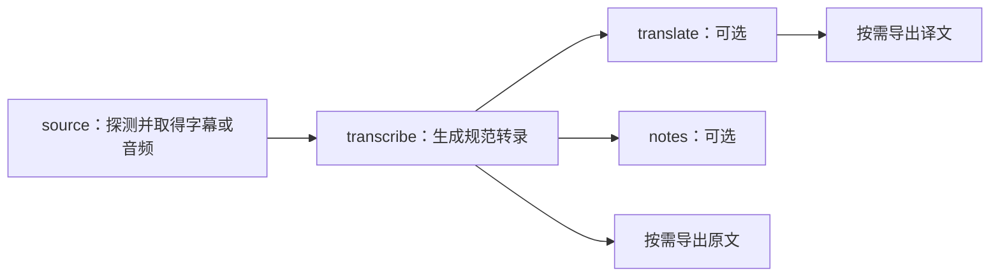

# VtNote V1 产品需求文档

状态：可执行基线
版本：V1
Owner：VtNote 产品/工程负责人
下次评审：实现计划 Task 4 启动前；外部接口、价格或合规边界变化时提前评审
证据截止：2026-07-28
对应实现计划：[2026-07-28-vtnote-v1-completion.md](superpowers/plans/2026-07-28-vtnote-v1-completion.md)

## 1. 产品定义

VtNote 是一款面向 Windows 单机用户的本地优先视频转录与笔记工具。用户可提交
Bilibili/YouTube 的公开链接、本地媒体或本地字幕；系统先尝试直接使用原生字幕，
没有可用字幕时才获取音频，并在得到明确上传同意后优先尝试已测试的腾讯云录音文件
识别，否则使用本地 faster-whisper。翻译与 AI 笔记只调用已测试的国内官方模型 API，
是互不阻塞的可选后续分支；所有结果以不可变的规范转录 JSON 为源头按需导出。

V1 的产品承诺是“把一段允许访问的视频可靠地变成可追踪、可导出的文本资产”，
而不是万能下载器、字幕精修台或知识库。

## 2. 问题与机会

目标用户目前需要在链接下载、字幕检查、音频转码、云端或本地转录、翻译、总结和
格式导出之间手工搬运文件。常见问题包括：

- 已有字幕仍重复跑 ASR，浪费时间和费用；
- 平台解析、云服务、模型和网络任一环节失败后，无法判断是否安全重试；
- API 密钥、原始媒体和生成文件混放，隐私边界不清；
- 翻译或总结失败会遮蔽已经成功的转录；
- 产物缺少稳定结构，后续无法确定文本、时间戳与来源是否一致。

VtNote 用明确的阶段、不可变规范产物、可恢复任务和本地数据边界解决这些问题。

## 3. 目标与非目标

### 3.1 V1 目标

1. 支持公开 Bilibili/YouTube URL、本地媒体、本地字幕三类入口。
2. 对所有入口执行字幕优先策略，避免不必要的音频下载与 ASR。
3. 在“云端配置已测试 + 当前 connection/profile 修订已有明确上传授权”时使用
   腾讯云标准录音文件识别与大模型 2.0，并以本地 faster-whisper 作为可控后备。
4. 让转录、翻译、笔记、导出彼此解耦；可选分支失败时仍可交付已完成结果。
5. 在应用重启后保留任务、阶段尝试、产物和可操作错误。
6. 默认只监听本机回环地址，不在数据库、日志或 API 中暴露密钥。
7. 提供清晰的创建、进度、历史、详情与设置体验。

### 3.2 V1 不做

- 登录态、Cookie、浏览器扩展、会员/付费/私有/地区受限内容；
- DRM 绕过、平台批量抓取、频道/播放列表批处理；
- 硬字幕 OCR、弹幕抓取、视频下载器式媒体导出；
- 逐字级字幕编辑器、波形时间轴、多人协作；
- 说话人分离、WhisperX 强制对齐、配音与烧录字幕；
- RAG、跨视频知识库、聊天问答；
- 插件框架或运行第三方任意代码；
- macOS、Linux、服务器多用户或公网部署；
- 自动删除用户原始文件；
- 将商业供应商的价格、可用性或保留策略写成永久保证；
- 调用国外模型 API 或未经审计的模型中转站；若将来改变，必须由用户明确批准并新增
  ADR、区域/隐私审计和迁移方案。

上述项目若进入后续版本，必须重新做产品决策、威胁建模和验收。

### 3.3 版本边界

**V1.1 候选（必须单独评审，当前不承诺）**

- Argos Translate 中英离线语言包：按需下载到 D 盘应用数据/模型目录，不随安装包
  预置；先验证语言包质量、体积、来源、哈希和许可证；
- 显式浏览器助手：只在用户主动安装、明确授权和可撤销的前提下重新评估，用于改善
  公开页面探测；不得演变为静默读取 Cookie 或绕过登录/付费/地区限制。

**Later 候选**

- WhisperX 逐字对齐与说话人分离、字幕精修、批处理、更多平台、配音、RAG/跨视频
  知识库。

**持续排除**

- DRM/访问控制绕过、未授权内容抓取、公网多租户服务、自动删除用户原件。

## 4. 用户与核心场景

### 4.1 用户角色

| 角色 | 主要任务 | 关键顾虑 |
|---|---|---|
| 内容研究者 | 把公开视频转成可搜索文本和结构化笔记 | 时间戳可信、失败可恢复、可导出 |
| 学习者/创作者 | 处理中文、英文或混合语音，并按需翻译 | 操作简单、结果可校对、费用透明 |
| 隐私敏感的本地用户 | 处理不希望默认上传的本地媒体 | 默认本地、明确同意、密钥与数据隔离 |

### 4.2 关键旅程

**旅程 A：公开 URL 有原生字幕**

1. 用户粘贴 Bilibili 或 YouTube 公开链接。
2. 系统校验主机与 URL，探测标题、时长和字幕轨。
3. 用户确认轨道与可选的翻译/笔记。
4. 系统保存源字幕并生成规范转录，不下载音频、不调用 ASR。
5. 用户查看带时间戳文本并导出。

**旅程 B：公开 URL 无字幕**

1. 系统探测后明确显示“未发现可用字幕，需要音频转录”。
2. 若云端配置已通过连接测试且该 connection/profile 修订已有明确上传授权，系统
   展示供应商、预估上传时长/大小、隐私与计费摘要；用户仍可切换为仅本地。
3. 若当前修订尚未授权，用户完成一次明确授权；相关地址、模型或配置修订变化后授权
   失效，必须重新确认。随后 `auto` 可按快照自动云端优先。
4. 云端明确失败时按模式转本地，结果不确定的超时不得盲目再次提交云请求。
5. 转录完成后，翻译与笔记并行执行；任一可选分支失败不影响原文结果。

**旅程 C：本地媒体且不上传**

1. 用户选择本地媒体并选择“仅本地”。
2. 浏览器上传把字节流写入受控接入目录；受信本机路径入口只以只读方式打开原件并把
   所需运行资产写到受控目录。两条入口都绝不修改或删除原件。
3. 系统校验媒体、提取音频并运行 faster-whisper。
4. 用户在任务详情查看来源、模型、耗时、警告和导出。

**旅程 D：已有字幕**

1. 用户上传 SRT、VTT、ASS 或经过校验的规范 JSON。
2. 系统解析、排序并校验时间范围与文本编码。
3. 转录阶段标记为无需 ASR；用户可直接运行翻译/笔记和导出。

## 5. 范围与平台支持

| 输入 | V1 支持 | 边界与失败口径 |
|---|---|---|
| Bilibili URL | 公开、无需登录、平台适配器能解析的单个视频 | 非官方稳定字幕合同；登录/会员/地区/下架/交互或异常稿件可明确拒绝 |
| YouTube URL | 公开、无需登录、平台适配器能解析的单个视频 | 私有、年龄/地区/登录限制或平台变更可明确拒绝 |
| 本地视频/音频 | MP4、MKV、MOV、WebM、AVI、M4V、MP3、M4A、WAV、FLAC、OGG、Opus | 扩展名、大小、实际媒体内容与 FFmpeg 探测均须通过 |
| 本地字幕 | SRT、VTT、ASS、规范 JSON | UTF-8、非空、可解析、时间范围有效；原始字节保留在受控目录 |
| URL 批量输入 | 不支持 | 一次任务可保留多 item 的后端结构，但 V1 网站只创建单个来源 |

Bilibili 字幕能力风险与官方开放平台审计见
[COR-004](research-sources.md#cor-004--bilibili-subtitle-access)；这是一项易变适配能力，
不是对任意链接成功率的承诺。

## 6. 处理模型

### 6.1 阶段图

`translate` 与 `notes` 都只依赖 `transcribe`，互不依赖。笔记默认基于原始规范转录，
不得隐式改为基于译文。

### 6.2 状态词汇

阶段状态固定为：

- `queued`：等待执行；
- `running`：正在执行；
- `cancel_requested`：已请求停止，等待执行器到安全检查点；
- `canceled`：本次尝试已取消；
- `failed`：本次尝试失败，并带稳定机器错误码；
- `completed`：本次尝试成功；
- `skipped`：按已记录决策无需执行。

item/task 聚合状态为 `queued`、`running`、`cancel_requested`、`canceled`、
`failed`、`completed`、`completed_with_warnings`。核心阶段 `source` 或
`transcribe` 失败使 item 失败；可选阶段失败或取消使已成功的 item 进入
`completed_with_warnings`。

## 7. 功能需求

### FR-001 首次启动与就绪检查

应用首次启动必须显示数据目录、运行缓存目录、FFmpeg、数据库、密钥存储、本地模型，
以及 YouTube 完整支持所需的 yt-dlp/`yt-dlp-ejs`/Deno 状态。缺少必要组件时应提供
可执行修复信息；只有必需项通过后才能创建依赖该组件的任务。默认监听
`127.0.0.1:8765`。

验收：

- 就绪页区分“必需失败”“可选未配置”“已就绪”；
- 检查不会向前端返回密钥值；
- 未配置云端或聊天模型时，本地转录仍可使用；
- 缺少 `yt-dlp-ejs` 或受控 Deno 时，YouTube URL 显示“运行链未就绪”且不宣称完整
  支持；Bilibili、本地文件和本地字幕按自身依赖继续可用；
- 本地模型未安装时可由用户显式启动受管下载，显示固定来源/revision、总大小、逐文件
  进度、取消/恢复和哈希结果；失败或取消的 staging 进入可恢复回收区，任务执行不得
  隐式联网下载模型。

### FR-002 连接、配置档与默认项

用户可创建、更新、归档并测试腾讯云 ASR 和国内官方 chat 连接/配置档，
设置 ASR 模式 `auto|cloud|local`、翻译默认值和笔记模板。笔记模板固定为“综合总结”
“干货提炼”“自定义提示词”三项。任务创建时必须保存不可变配置快照，后续修改默认项
不得改变已入队任务。自定义提示词在默认项和任务快照中只保存 DPAPI 保护 envelope；
公开读取只返回“已配置”，不回显明文。

验收：

- 密钥只写入 Windows Credential Manager/keyring；API、SQLite、日志只出现
  `has_secret` 或不可逆引用；
- V1 chat 连接只接受单个合法 `workspace_id`，由应用构造阿里云百炼华北 2（北京）
  工作空间官方 HTTPS endpoint；不接受任意 Base URL、国外 API 或第三方中转站；
  使用的是兼容协议，不是国外服务；
- 静态地址/字段校验只产生 `connection_policy_validated`，不能启用配置档；只有当前
  connection/profile 修订的远程 `profile_capability_tested` 成功，且对应音频或文本
  数据授权修订仍有效时，配置档才可用于新任务；
- 翻译默认关闭；首个当前修订 AI 配置档能力测试和文本数据授权都成功后，笔记一次性
  默认启用并默认输出简体中文；用户关闭或改语言后不得再次被系统自动覆盖；
- 归档中的配置若仍被历史/可重试任务引用，引用关系保持可追踪；
- 升级时旧 Volc/任意 `openai_compatible` 配置自动归档、清除默认项并使测试/授权失效；
  旧 queued/running 快照在读取密钥或联网前稳定失败并提供本地/重新配置动作；
- 明文自定义提示词只在创建/替换请求和编辑控件中短暂存在，不进入公开响应、任务
  详情、浏览器存储、日志、错误、诊断包、URL 或导出。

### FR-003 URL 校验与安全探测

系统只接受 HTTPS 的 Bilibili/YouTube 允许主机和规范链接；探测必须阻止凭据型 URL、
非允许端口、重定向到非允许主机、回环/私网/链路本地目标与不安全解析结果。
所有平台 outbound HTTP 客户端固定 `trust_env=false`，不得继承系统或进程环境中的
HTTP(S) 代理。中国网络环境不保证 YouTube 直连；一次直连超时只能记为环境观察，
不能写成平台永久不可用。

验收：

- 非允许平台在任何网络请求前被拒绝；
- 重定向每一跳均重新校验；
- 真实 transport 对每一连接执行 DNS/IP 校验，且测试证明系统/环境代理不会被静默
  使用；
- 探测输出只含安全的标题、时长、平台、公开字幕元数据和机器错误码；
- 未注册真实平台适配器时返回明确的“不支持/未实现”，不伪造成功；
- direct-only Bilibili/YouTube 可达性进入 30–50 视频 POC；不可达时建议使用用户合法
  持有的本地文件，不提供绕过说明；
- YouTube adapter 使用固定 `yt-dlp==2026.7.4`、`yt-dlp-ejs==0.8.0` 与受控 Deno
  2.8.1 初始研究组合。`yt-dlp-ejs` wheel 和 Deno Windows x64 单文件按哈希放在 D 盘，
  Deno cache 也重定向到 D 盘；禁止自动更新、系统 C 盘 Node 兜底和运行时下载远程
  EJS component。该组合必须通过平台 POC 后才可冻结为发行支持；
- 显式可信代理不属于 V1。若未来加入，必须新增 ADR、代理威胁模型和逐用户同意；
  HTTP CONNECT 使客户端通常只能对代理地址做 DNS/IP pin，与目的站逐连接 pin 冲突，
  不得为了可达性静默放松 SSRF 边界。

### FR-004 本地文件与上传接入

用户可通过浏览器上传或本机选择受支持媒体/字幕。系统以流式方式限制请求与文件大小，
清理显示文件名，校验扩展名和实际内容，并在任务接纳后转移到应用管理目录。

验收：

- 空文件、过大文件、扩展名伪装、损坏媒体、无有效 cue 的字幕均被拒绝；
- 部分上传和校验失败文件进入可审计的受控隔离/回收流程；
- 用户原文件永不修改或删除；
- 普通 task/item/result API 不返回用户原件或受信来源的绝对路径；专用 setup/storage
  API 可返回应用管理根目录，以便用户理解数据位置和清理边界。

### FR-005 创建任务、快照与历史

每次提交生成持久化 task、item 与阶段尝试记录；保存经过清理的来源、用户选项、提供商
配置快照、创建时间和产物引用。应用重启后历史仍可查询。

验收：

- UI 在提交中禁用重复提交；创建成功立即导航到详情，之后刷新只执行 GET；
- 历史列表可按状态查看并进入详情；
- 当前尝试与旧尝试可区分，旧记录不可静默覆盖；
- 删除/归档配置不破坏历史快照的可读性。

### FR-006 字幕优先选择

URL 来源必须先枚举并排序可用字幕。固定顺序为“首选语言人工字幕 → 首选语言自动
字幕 → 其他语言人工字幕 → 其他语言自动字幕”；每组内先按语言优先级，再按
`VTT > SRT > ASS > JSON`。每一条候选字幕都须下载并验证，所有候选失效后才允许
取得一次音频。本地字幕直接进入规范化流程。

选择前排除 translated track 与 live chat；adapter 无法确定人工/自动属性时保守视为
自动。组、语言和格式都相同时，以稳定 track ID 作最终决胜，保证重复探测结果一致。

验收：

- 有有效原生字幕时，音频下载次数与 ASR 调用次数均为 0；
- 单个字幕轨损坏会尝试下一条，并记录安全警告；
- 所有字幕失败后只进行一次音频取得；
- 最终选择、语言、是否自动/翻译字幕和回退原因写入来源记录。

### FR-007 音频取得与预处理

需要 ASR 时，平台适配器只取得执行所需音频；本地媒体直接复用 FFmpeg/FFprobe，
通过无 shell 参数调用完成探测、解封装、解码和受控转码。VtNote 不自研 codec 或媒体
封装器。云端与本地可使用不同输出容器，但都必须原子发布。

验收：

- 命令以 argv 直接执行，限制超时和输出大小；
- 失败或中断产生的部分文件不会被下次尝试误认成成功资产；
- 临时文件、完成资产和回收站都位于受控运行目录；
- 不把源媒体作为导出下载提供给用户；
- 发布冻结时对实际随包 FFmpeg 二进制运行 `-version/-buildconf`，把版本、configure、
  对应源码和许可证写入 SBOM/NOTICE；不得用当前开发机的许可证结论代替发行构建审计。

### FR-008 ASR 路由、同意与费用提示

`local` 永不上传；`cloud` 仅在当前云配置测试成功且当前 connection/profile 修订
已有明确上传授权时执行。授权绑定到相关配置、地址和模型修订；任一相关修订变化后
自动失效并要求重新授权。`auto` 在授权有效时可自动云端优先；创建页仍展示供应商、
区域提示、估算媒体时长/上传大小与“可能计费”，并允许用户切换为本地。没有当前
测试成功且已授权的云 profile 时，`auto` 仍可提交，但任务快照固定为本地路由；只有
`cloud` 被阻止。

验收：

- 当前修订没有有效上传授权时不得发送云请求；
- 确认页清楚区分“估算”与供应商最终计费；
- 任务快照记录授权修订、配置修订和路由选择，但不记录密钥；
- `auto` 无有效云 profile 时快照不含云配置，并直接选择本地；
- 用户可在提交前切换为仅本地。

### FR-009 腾讯云标准录音文件识别

V1 云端实现固定使用腾讯云 API 3.0 的 `CreateRecTask + DescribeTaskStatus`，ASR
地域固定为官方当前列出的 `ap-guangzhou`，默认引擎为 `16k_zh_en_2.0` 大模型
2.0，`ChannelNum=1`、`ResTextFormat=3`、`SentenceMaxLength=20`，关闭说话人、
情绪、语义分段和口语转书面语等额外计费能力。音频统一转为 16 kHz、单声道、
32 kbps OGG/Opus。标准版不需要 AppID；V1 只支持存放于 Credential Manager 的
SecretId、SecretKey 原子凭据包和最小权限子账号，不支持无法自动续期的临时 STS
凭据/session token。

编码后整文件不超过应用阈值 4,500,000 字节（低于供应商 5 MB 边界）时，以
`SourceType=1`、Base64 `Data` 和未编码字节
`DataLen` 直接提交。更大的、最长 5 小时且不超过 1 GB 的音频，只在当前 profile
配置并测试了私有 COS 桶时上传为不可预测对象键，再用最长 6 小时的单对象预签名
GET URL 以 `SourceType=0` 提交。V1 不切片、不使用公开桶、不把签名 URL 写入数据库
或日志。COS 未就绪、超过供应商边界或语言不合格时，`auto` 在发送前固定转本地，
`cloud` 阻止提交并解释原因。接口、限制与结果结构以腾讯云
[CreateRecTask](https://cloud.tencent.com/document/product/1093/37823)、
[DescribeTaskStatus](https://cloud.tencent.com/document/product/1093/37822)和
[数据结构](https://cloud.tencent.com/document/product/1093/37824)为准。

验收：

- 发送前预检语言、时长、OGG/Opus 字节数、Base64 长度和峰值内存；Base64 长度按
  `4 * ceil(binary_bytes / 3)` 计算，只有未编码字节 `<=4,500,000` 才走整文件
  内联；
- profile 的语音范围固定为中文、英语、粤语和该引擎官方列出的中文方言。创建页必须
  保存显式 `spoken_language_scope=zh_en_dialects`；可靠元数据明确为日语、韩语等
  范围外语言时云端不可选，元数据未知时页面明确“按所选中英方言范围处理”，不得宣称
  自动语种检测；
- 远程 profile 能力测试必须使用用户主动选择的 2–10 秒有声样本，经正常上传边界
  校验并明确同意可能计费；静音或纯静态校验不能授予生产转写能力；
- COS 桶必须为私有且地域固定 `ap-guangzhou`，桶名/prefix 通过严格校验，SDK 使用显式
  `trust_env=false` 等价会话、禁止重定向和自动上传重试；对象键不含标题、URL 或
  用户路径；
- COS 上传成功后才允许创建 ASR 任务。只有腾讯 provider 明确返回 `success|failed`
  才立即删除；`submission_unknown`、本地取消或停止等待不等于远端终态，对象保留到
  已知远端终态，或 6 小时签名 URL 过期再加 30 分钟宽限后由独立维护任务清理。桶的
  1 天生命周期只是按日扫描的漏删兜底，不承诺精确 24 小时；本地编码音频仍按 24
  小时可恢复回收策略处理；上传、延期、删除和漏删均审计；
- `CreateRecTask` 没有文档化幂等键。请求体明确未发送时可安全重试；可能已发送但
  没有收到 `TaskId` 时记录 `submission_unknown`，禁止自动重新提交付费任务，
  `auto` 可转本地并持续显示“云端可能已计费”；
- 一旦获得 `TaskId` 和服务端 `RequestId`，先原子持久化，再轮询；worker 重启后只
  查询既有任务，不重新创建。`TaskId` 按字符串处理，与 provider、提交日期和本地
  stage attempt 组合标识，不能当全局唯一值或传给 JavaScript Number；
- `waiting/doing/success/failed` 分别映射为等待、执行、成功、失败；查询网络错误可
  重试，创建请求不可盲重试。提交 24 小时内的 `FailedOperation.NoSuchTask` 停止
  轮询并进入可操作错误，要求检查地域、凭据、TaskId 和提交日期；超过结果保留窗口
  标记 `provider_result_expired`，两者都不得自动重新付费提交；
- 成功结果必须有可验证的 `ResultDetail`、非空 `FinalSentence` 和合法
  `StartMs/EndMs`；缺少时间戳时记录 `provider_result_missing_timestamps`，不伪造
  时间轴，`auto` 可转本地并保留云调用警告；
- `AuthFailure.InvalidAuthorization`、`FailedOperation.CheckAuthInfoFailed`、
  `FailedOperation.UserNotRegistered`、`FailedOperation.ServiceIsolate`、
  `FailedOperation.UserHasNoAmount`、`FailedOperation.UserHasNoFreeAmount` 和
  `InvalidParameter*|MissingParameter|UnknownParameter` 停止并提示修复；
  `FailedOperation.ErrorDownFile|FailedOperation.ErrorRecognize`、
  `RequestLimitExceeded.UinLimitExceeded` 和 `InternalError.*` 可让 `auto` 转本地，
  但同一 attempt 不重新创建云任务；HTTP 200 内的 `Response.Error` 同样按此表处理；
- 只保存限长 RequestId、TaskId、状态、供应商错误码、音频哈希、桶/对象键和安全
  诊断；SecretId/SecretKey、Base64、预签名 URL、provider message 和
  原始响应不得进入数据库、日志、任务快照或产物；
- 本地取消只能停止用户等待，不能取消腾讯远端任务或保证停止计费；独立提交协调器
  仍按到期时间做单次查询/清理，不持有主 worker lease；UI 必须明确说明；
- 授权绑定当前 profile/connection 修订；engine、COS bucket/prefix、凭据或其他相关
  配置变化会使能力测试与上传授权失效。

### FR-010 本地 faster-whisper 与云端后备

本地转录的已批准 V1 默认固定为 faster-whisper `large-v3-turbo`、
`compute_type=int8_float16`、VAD 开启、分段级时间戳和单个 GPU worker 并发 1。
faster-whisper/CTranslate2、模型文件和 CUDA/cuBLAS/cuDNN 发行组合必须固定版本、
校验后放在 D 盘受控目录，不得静默升级或写入 C 盘。30–50 视频 POC 是验证与重审
门禁，不是让实现者把这些默认项改回 TBD；任何默认变更都需要用户明确批准并更新 ADR。

`auto` 模式下，云端在明确未受理、明确 429/5xx 或已分类网络失败后可自动转本地；
结果不确定的云超时可转本地并保留“云端可能已计费”警告，但不得重发云请求。配置
错误停止并提示修复。`cloud` 模式失败后由用户明确选择“改用本地”或修复后创建新的
云端尝试。

验收：

- 首次需要模型下载时展示大小/来源/进度和磁盘错误；
- 模型安装固定 manifest 与 revision，下载到 D 盘 staging，逐文件校验 SHA-256 后
  原子发布；中断可恢复、取消可审计，运行时强制 `local_files_only`；
- NVIDIA GPU 是 V1 本地 ASR 发布路径；GPU/CUDA 不满足时显示可诊断的“本地 ASR
  不可用”，字幕路径和已授权云路径仍可部分使用；
- CPU 只做诊断性/未来备选，不是 V1 发布必选项，也不得成为静默性能退化路径；
- 云转本地后只有一个规范转录被发布，云端迟到结果不得覆盖；
- 模型、模型哈希、设备、CUDA 组合、计算精度、VAD、worker 并发和运行耗时写入
  provenance。

### FR-011 不可变规范转录

所有字幕/ASR 输出转换为 UTF-8、确定性序列化的 `transcript.json`，包含 schema 版本、
语言、来源方法、时长、按序 cue ID、起止毫秒、文本和 provenance。文件通过原子
“仅创建”方式发布；同一 item 的已发布规范转录不得覆盖。

验收：

- cue ID 唯一，时间非负、结束大于开始、顺序稳定；
- 相同模型输入可得到字节稳定的规范序列化；
- 已存在文件时写入失败并保留原文件；
- 后续译文包含源转录哈希并验证 cue 一一对应。

### FR-012 可选翻译

用户可选择目标语言和已测试的国内 chat 配置档。V1 只实现阿里云百炼华北 2（北京）
工作空间的官方 Chat Completions endpoint；模型名由用户从同地域工作空间确认后填写，
并通过一次明确提示“可能产生少量费用”的 JSON 能力测试。翻译以规范 cue 为单位，
保留 cue ID 和时间，不修改原文。长文本分块必须保留顺序并验证结构。

验收：

- 默认关闭，未选择有效配置时不能启用；
- 只接受单个 DNS label 形状的 `workspace_id`，由应用构造
  `https://{WorkspaceId}.cn-beijing.maas.aliyuncs.com/compatible-mode/v1`；禁止
  重定向、任意主机/路径/端口和非官方中转站；V1 不假定存在可用的 `/models`，以
  用户填写模型 + 最小非流式 `json_object` profile test 为准；
- profile 能力测试不等于授权上传真实字幕。独立 `chat_data_consent_revision` 绑定
  endpoint、credential revision、model、`response_format`、thinking 模式和生产
  options；提交页必须列出将上传的字幕 cue、标题/元数据、目标/输出语言、自定义提示词，
  并明确“不上传音频”和“可能计费”；
- 每个翻译请求固定 `stream=false` 和 `response_format={"type":"json_object"}`；除
  明确拒绝受理的 429 可遵从 `Retry-After` 自动重试一次外，500/503、读取超时或连接
  中断均记为 `chat_submission_unknown`，不得自动重发；
- 翻译失败不阻止原文查看/导出，item 为 `completed_with_warnings`；
- 部分/格式错误响应不得作为完整译文发布；
- 可独立重试翻译，不重跑 source/transcribe/notes。

### FR-013 可选 AI 笔记

用户可选择“综合总结”“干货提炼”或“自定义提示词”。笔记与翻译复用同一受控国内
Chat 协议，但可以选择不同的百炼模型/profile。一旦当前修订 AI 配置档测试
成功，笔记默认开启并默认输出简体中文；用户可关闭或显式更改语言，系统不得反复覆盖。
笔记直接读取不可变原文转录，不读取译文。笔记应携带任务/转录来源标识，并明确标注为
AI 生成内容。

验收：

- 自定义模板必须含非空提示词；
- 提示词和响应大小有上限；长字幕严格按时间顺序分块，每块记录首末 cue ID/时间，
  先生成块摘要，再按原顺序合并，并保留块摘要到规范 cue 的映射；
- map、reduce 和最终响应每一层都固定为非流式 `json_object`，由本地 schema 校验后
  再渲染 Markdown；引用必须属于当前块或显式传递的 citation lineage；
- 最终笔记包含可点击且可核验的时间点引用；每个引用必须解析回同一
  `transcript.json` 中存在的稳定 cue ID，并显示对应时间与原文；
- 笔记失败不阻止转录/译文交付；
- 可独立重试笔记，不重跑成功的平行翻译；
- 结构化笔记产物和 Markdown 都保存任务 ID、转录 SHA-256、请求/响应模型标识及
  `generated_by_ai=true`；UI/导出明确标注“AI 生成”，并提醒用户复核姓名、数字、
  专业术语和关键引用。

### FR-014 进度、决策与诊断

任务详情必须显示当前阶段、阶段尝试、开始/结束时间、可测进度、警告和下一步操作。
没有可靠分母时不得伪造百分比，只显示阶段级忙碌状态。所有用户可见错误同时包含稳定
错误码、自然语言解释和建议动作。

验收：

- URL 不可访问、无字幕、需要上传授权、模型未安装、密钥失效、配额、磁盘不足、
  取消中、云结果不确定和可选分支失败均有独立展示；
- 日志/错误自动清理 URL 查询凭据、Authorization、API key、本机路径和提示词中的
  已知密钥；
- 刷新页面不会丢失进度，重启后状态从数据库恢复。

### FR-015 取消

用户可取消非终态任务。排队阶段立即变为 `canceled`；运行阶段先变为
`cancel_requested`，执行器在安全检查点停止并清理/隔离部分资产。除“已因取消进入
`canceled`”的幂等读取外，其他终态不能取消。

验收：

- 对 `cancel_requested` 重复取消返回当前资源；已因取消进入 `canceled` 后重复取消
  也返回当前资源；`completed|completed_with_warnings|failed` 等其他终态拒绝；
- 已完成的规范转录不会因取消可选分支而删除；
- 外部请求无法撤回时 UI 明确说明，并阻止盲目重复；
- 取消后的 `failed|canceled` 阶段按重试规则处理。

### FR-016 阶段重试

只能重试最新尝试为 `failed` 或 `canceled` 的阶段。每次重试创建新 attempt；重试
上游会使依赖的下游结果失效并重新排队，翻译与笔记可在不相互影响的前提下独立重试。

验收：

- 同阶段已有 `running|cancel_requested` 尝试时拒绝重复重试；
- 与活跃依赖阶段冲突时拒绝并要求刷新；
- `submission_unknown` 不提供“一键重复云端”，只提供“检查供应商”“改用本地”
  或带二次费用警告的显式新尝试；
- `POST /api/tasks/{id}/retry` 必须携带 `expected_attempt`。未知云结果只接受
  `strategy=local`，或 `strategy=cloud_confirmed` 加
  `acknowledge_possible_charge=true`、当前 profile ID 与 connection/profile revision；
  普通 `strategy=same` 被拒绝；
- 显式 retry 把本次覆盖写入新的 attempt snapshot，不读取当前默认项；云端新 attempt
  还必须重新通过当前修订测试和上传授权；
- 历史 attempts 和已失效产物仍可审计，当前结果指向最新有效尝试。

### FR-017 结果查看与按需导出

详情页显示来源、分段时间戳、原文、可用译文、笔记和 provenance。系统从规范 JSON
按需、确定性生成 JSON、SRT、VTT、TXT、Markdown，不持久化无必要的派生副本。

验收：

- 原文与译文导出明确区分；译文缺失时不得回退成原文并冒充译文；
- 同一规范输入重复导出字节一致；
- 超出 SRT/VTT 表达范围时给出可操作错误；
- 用户可复制文本，并从详情页下载单个结果文件。

### FR-018 数据保留、回收与存储可见性

代码位于仓库；持久数据默认位于 `D:\Workspace\Project\VtNote-data`；运行缓存默认位于
`D:\Workspace\Codex\cache\VtNote-runtime`。应用管理资产的清理由应用移动到可恢复
回收区，保留至少 24 小时并记录日志；用户原件不在清理范围。

验收：

- 设置页显示路径、占用量、保留规则和“受应用管理/用户原件”边界；
- 清理前重新验证目标解析路径仍位于允许根目录；
- 每次移动、清理失败和永久清除均有时间、类型、目标 ID 与结果；
- 恢复窗口内可以恢复被应用清理的资产。

### FR-019 执行摘要与来源证明

每个 item 必须能回答：输入来自哪里、选中了哪条字幕或为何使用 ASR、是否上传给谁、
使用了哪个配置修订/模型、是否发生回退、各阶段耗时和最终有哪些警告。不得展示密钥、
原始认证头或不必要的绝对路径。

验收：

- 摘要可从持久化记录重建，不依赖进程内状态；
- 云端上传授权修订、未知结果和潜在费用警告可追溯；
- 导出的 JSON/Markdown 包含安全的 schema、来源方法和规范产物中已固定的时间字段，
  不在每次按需导出时注入动态生成时间；
- 产品分析只在本机聚合，V1 不发送遥测。

## 8. 非功能需求

### NFR-001 本地网络边界

生产启动器只监听 `127.0.0.1:8765`，前后端同源，不启用宽松 CORS。所有变更接口使用
本地会话/CSRF 防护，并校验 `Host` 与 `Origin`。

### NFR-002 密钥与隐私

密钥只存 Windows Credential Manager/keyring；数据库、API、日志、测试快照与任务
产物中密钥明文出现次数必须为 0。云端上传必须引用当前测试成功且明确授权的
connection/profile 修订；相关修订变化后重新授权。供应商保留/训练承诺以当前账户
合同为准。

### NFR-003 持久性与恢复

任务队列由 SQLite 持久化，执行器使用租约、心跳和有界重领。进程在任一阶段被终止后，
重启不得丢任务或把部分文件当成成功；每个外部副作用必须有幂等键或明确的未知结果
处理。

### NFR-004 文件与命令安全

所有受控路径使用类型化构造并在写入/移动前验证解析结果。禁止拼接 shell 命令，限制
子进程超时、输出和资源使用。任何删除都应先移入受控回收区。

### NFR-005 兼容性

V1 支持 Windows 10/11 x64、Python 3.11、现代 Chromium/Edge 浏览器。本地 ASR 的
发布路径要求通过矩阵验证的 NVIDIA GPU/CUDA 组合；CPU 只做可诊断的未来备选，不是
V1 发布门禁，也不承诺可用性能。具体模型、驱动、CUDA/cuBLAS/cuDNN 组合须固定版本
并在发布矩阵中列明，未验证组合不得标为支持。

### NFR-006 可用性与无障碍

核心流程可仅用键盘完成；焦点可见；表单、错误和进度具有文本标签；颜色不是唯一状态
信号；普通文本和交互控件达到 WCAG 2.2 AA 对比度目标；在 200% 缩放下不丢失核心
操作。

### NFR-007 可观测性

日志采用结构化事件和稳定错误码，包含 task/item/stage/attempt 关联 ID、耗时、安全
诊断和脱敏的 provider log ID，不包含密钥、认证头、媒体字节、完整提示词、原始云端
响应或未清理本机路径。用户可导出脱敏诊断包。

### NFR-008 性能与诚实进度

API 的创建、列表、详情、取消与重试在本地基准数据量下应保持交互响应；长耗时工作只
在 worker 执行。只有测得总量时才显示百分比。发布前必须记录转录 real-time factor、
峰值内存、磁盘放大率和 UI 轮询负载，而不是预先宣称速度。

### NFR-009 质量与可维护性

提供商、来源和 AI 能力通过显式接口隔离；规范 schema、数据库迁移和公开错误码需要
版本控制。功能与修复采用测试先行；发布门禁包括单元、集成、故障注入、安全回归与
端到端测试。

### NFR-010 合规与来源边界

产品只处理用户有权访问和处理的内容，UI 提醒遵守平台条款与版权。V1 不规避访问控制，
不声称 Bilibili 网站接口为官方开放 API。第三方依赖的许可证与 NOTICE 随分发清单
审计；yt-dlp、`yt-dlp-ejs`、Deno 及其实际 wheel/binary 的版本、哈希、传递组件和
许可证必须进入 SBOM。FFmpeg 直接作为第三方工具复用，不自研 codec/封装；实际发行
二进制的 `-buildconf`、对应源码和 LGPL/GPL 条件必须在发布冻结时审计。

## 9. 成功指标与发布门禁

以下是待验证目标，不是当前实现成绩：

| 指标 | V1 发布门禁 |
|---|---|
| 字幕优先正确性 | 验收集中所有可用且可解析的原生字幕样本，音频下载/ASR 调用均为 0 |
| 平台网络边界 | `trust_env=false` 下按目标中国网络环境记录可达性/错误；不继承系统代理，不把单次超时外推为平台结论；受控 EJS/Deno 链通过就绪/许可证/YouTube corpus 门禁；本地文件后备可完成 |
| 核心任务可靠性 | 合法、在支持边界内的验收样本无任务丢失；重启/崩溃注入后可恢复或进入明确终态 |
| 产物完整性 | 每个成功 item 有且只有一个不可变规范转录；schema 与哈希校验 100% 通过 |
| 可选分支隔离 | 翻译/笔记故障注入不降低原文可查看、可导出能力 |
| 笔记可追溯性 | 每个时间点引用都能解析到规范 cue；顺序分块/合并不改变引用所指原文 |
| 隐私与安全 | 自动扫描与测试中密钥泄漏、越界写入、修改用户原件、无有效修订授权的云上传均为 0 |
| 状态可解释性 | 预定义的失败/取消/未知结果场景全部映射到稳定错误码和至少一个下一步操作 |
| 无障碍 | 核心旅程键盘、焦点、标签、对比度和 200% 缩放检查通过 |
| 分发合规 | 实际 FFmpeg/依赖/模型 artifact 的 SBOM、NOTICE、许可证、源码对应关系和 build configuration 审计关闭 |

质量、速度和成本的比较阈值须由下面的 POC 得出并由产品负责人签字，不在没有数据时
编造“准确率领先”承诺。

## 10. 阈值登记

下列项目已由产品/技术负责人授权为**实施基线**，用于解除真实适配器、前端与 POC
之间的循环依赖；它们不是未经实测的永久性能承诺。精确数值和理由见 ADR-014。

| ID | 内容 | 当前状态 | Owner | 发布冻结门禁 |
|---|---|---|---|---|
| THR-001 | 浏览器媒体/字幕上传上限、request overhead | 实施基线：媒体 8 GiB、字幕 16 MiB、metadata 32 KiB、overhead 128 KiB；总 request 公式见 ADR-014 | 产品 + Backend + Security | ingress 内存/磁盘/失败恢复与浏览器上传验收 |
| THR-002 | 腾讯标准 ASR 内联/COS/内存硬限制 | 实施基线：编码音频 ≤4,500,000 B 走 Base64；较大且 ≤5 h、≤96 MiB 走私有 COS；估算 request ≤64 MiB，精确公式和查询退避见 ADR-014 | ASR + Backend + 产品 | Base64/COS 两路径、`4*ceil(n/3)`、真实峰值内存、时长分布、账单与失败 POC |
| THR-003 | 翻译/笔记 prompt、chunk、response 上限 | 实施基线：30/15 cues、64 KiB prompt、48 KiB note chunk、24 chunks/4 levels、256 KiB response | AI + Security + 产品 | provider context/capability 与最坏 cue corpus |
| THR-004 | 本地 API p95 目标与基准 task/item 数量 | 实施基线：100 tasks、热缓存、核心本地 API p95 ≤250 ms | Backend + QA | 固定设备重复基准与前端压力验收 |
| THR-005 | 前台/后台轮询间隔、退避与允许请求负载 | 实施基线：1/2/5 s 前台、15 s 后台、2/4/8/16/30 s 网络退避、单一在途 | Frontend + Backend + QA | THR-004、多标签与后台节流验收 |

POC 后维持或修改任一值，都要记录设备/语料、证据、批准人和日期。正式冻结前网站只
展示服务端实际限制，不作永久承诺。

## 11. 30–50 视频 POC 协议

### 11.1 样本

- 最少 30、最多 50 个用户有权处理的样本；
- Bilibili、YouTube、本地媒体每类至少 8 个；
- 普通话、英语、中英混合各至少 8 个；
- 覆盖 3–10、10–40、40–120 分钟时长档；
- 覆盖有人工字幕、有自动字幕、无字幕；清晰语音、背景音乐、口音、重叠说话；
- 记录地区、运营商/网络环境、direct-only 访问状态、采样日期，不纳入登录/会员/DRM
  内容；中国网络下 YouTube 超时按失败样本保留；
- V1 POC 的平台访问固定 `trust_env=false`；本地文件作为合法后备。显式代理另立研究，
  不混入 V1 直连成功率。
- YouTube 样本记录 yt-dlp、`yt-dlp-ejs`、Deno 版本/哈希和 EJS solver 路径；至少
  包含“完整链已就绪”“缺 EJS”“缺 Deno”“禁止远程 component”四类合同测试。

### 11.2 基准与标注

- 保存平台探测结果和可用字幕轨，不把平台自动字幕直接当绝对真值；
- 每个样本选择连续 5–10 分钟，人工校对文本和 cue 边界；姓名、数字、术语单独标记；
- 对翻译/笔记采用双人盲评；分歧由第三人裁决；
- 固定软件版本、模型、设备、网络区域和配置档修订。

### 11.3 度量

| 维度 | 度量 |
|---|---|
| 平台与字幕 | 探测成功率、原生字幕覆盖率、错误分类准确率、平台变更失败率 |
| ASR 文本 | 中文 CER、英文 WER、中英混合 token error、姓名/数字/术语错误率 |
| 时间戳 | 起止边界 MAE、P95 绝对误差、重叠/倒序/空 cue 数 |
| 稳定性 | 核心完成率、恢复率、取消延迟、重复副作用数、未知云结果数 |
| 性能 | wall time、real-time factor、峰值内存、CPU/GPU、磁盘放大率 |
| 云端成本 | 按供应商真实账单/usage 的实际计费、每音频分钟成本、编码后/Base64 字节、请求次数、潜在重复计费 |
| 翻译 | 意义保持、专名/数字保持、cue 完整率、人工 1–5 分 |
| 笔记 | 关键事实覆盖率、可回溯陈述比例、虚构/错误陈述率、人工可用性评分 |

### 11.4 对照与决策

同一无字幕样本在条件允许时运行腾讯云 `16k_zh_en_2.0` 与已批准默认
`large-v3-turbo/int8_float16/VAD/GPU concurrency=1`。V1 不调用国外 ASR 作为
对照；腾讯极速版、其他国内 ASR 也只做离线合同研究，除非用户另行批准一次明确的
付费 POC。两条正式路径按相同样本记录真实账单/usage，不在无实测时排列价格或质量
名次。记录失败而不是剔除困难样本。POC 前记录 ADR-014 的实施基线，POC 后输出原始
结果、置信区间/分布、
异常说明，冻结发布阈值并作出以下决策：

1. `auto` 是否继续云端优先；
2. 已批准本地默认模型/计算精度是否通过发布门禁；若建议改变，提交证据并等待用户
   明确批准，不由实现静默替换；
3. 允许的最长媒体与资源提示；
4. 哪些语言/场景需要降级声明；
5. Bilibili/YouTube 适配是否达到发布门禁；
6. 翻译与笔记是否可默认展示为正式能力。

在 POC 完成前，这六项的性能结论均标记为“待验证”，不得写成已确认成绩；这不撤销
已经批准的本地 ASR 默认合同。

## 12. 当前实现边界

在基线 HEAD `2a36eb0` 上，计划 Tasks 1、2、3A、3B 的后端基础已落地：规范转录与导出、
SQLite 数据模型、配置/任务 API、安全上传、本地来源校验、运行资产生命周期和 FFmpeg
媒体原语和基础确定性导出。现有 Markdown 是基础文本导出，尚不满足 FR-019 的完整
来源证明。真实 Bilibili/YouTube 适配、腾讯云/COS/本地 ASR 调用、租约 worker 主循环、
翻译/笔记执行、React 网站、启动器与发布验证仍未完成。逐项状态见
[traceability.md](traceability.md)；本文的需求状态不等同于实现完成。
