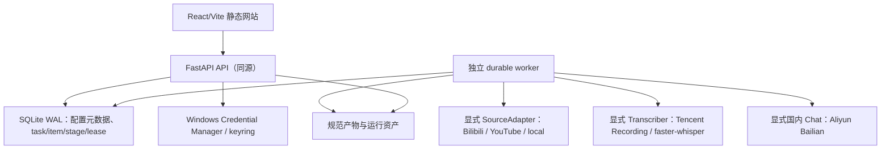

# VtNote V1 技术决策记录

状态：架构基线
Owner：VtNote 技术负责人
下次评审：[剩余开发计划](superpowers/plans/2026-07-28-vtnote-v1-completion.md)
Tasks 8、12、17、23 开始前，及 POC 结论产生后
证据截止：外部合同 2026-07-28；治理决议 2026-07-28
需求基线：[product-requirements.md](product-requirements.md)

## 1. 使用方法

本文记录 V1 已接受或暂定的技术决策。`Accepted` 表示实现应遵守，除非新增 ADR 明确
替代；`Provisional` 表示方向已选，但须由 POC 或外部合同复核后才能成为发布承诺。
“已接受”不代表代码已经完成，实际状态见 [traceability.md](traceability.md)。

每条 ADR 均记录背景、选项、决定、后果与重审触发器，避免把调研事实、产品需求和
当前实现混在一起。

## 2. 总体结构

边界：

- API 负责校验、配置生命周期、任务快照、查询与变更命令，不执行长任务；
- worker 通过 SQLite 租约/心跳领取阶段，不依赖 API 进程内队列；
- 适配器把外部结果转换为 provider-neutral 类型；
- 规范产物通过原子文件操作发布，数据库只保存元数据/引用；
- UI 只消费同源 API，不直接调用平台或 AI 供应商。

## ADR-001：Windows 本机、同源、回环监听

状态：Accepted
关联：FR-001、NFR-001、NFR-002、NFR-005

### 背景

V1 面向单个 Windows 用户，需要访问本机媒体、Credential Manager、FFmpeg 和本地
模型。公网服务会引入账户、租户隔离、上传、授权与运维问题。

### 选项

1. FastAPI 监听所有网卡，React 独立开发服务器；
2. Electron/原生桌面壳；
3. FastAPI 只监听 `127.0.0.1:8765`，生产 React 静态构建由其同源提供。

### 决定

采用选项 3。开发期可有 Vite 开发流程，但发布路径必须同源、验证 `Host`/`Origin`，
不配置宽松 CORS。启动器/监督器负责 API 与 worker 生命周期。

### 后果

- 简化 CSRF/CORS 与部署，保留浏览器开发效率；
- 仍须防范本机恶意网页发起的请求，因此变更接口需要本地会话/CSRF；
- 不支持局域网、远程访问或多用户；此限制必须在文档和启动日志可见；
- 将来若需要桌面壳，应复用 API/worker 边界，不把业务逻辑迁入 UI。

### 重审触发器

正式需求出现局域网/公网、多用户、移动端或操作系统原生深度集成。

## ADR-002：SQLite WAL 持久队列与独立 worker

状态：Accepted
关联：FR-005、FR-014 至 FR-016、NFR-003、NFR-007

### 背景

下载、转码、ASR、翻译和笔记可持续数分钟到数小时，必须跨页面刷新和进程重启。V1
又不需要 Redis/Celery 的独立服务。

### 选项

1. API 内存队列/线程池；
2. Redis + Celery/RQ；
3. SQLite WAL + task/item/stage_run + lease/heartbeat 的独立 worker。

### 决定

采用选项 3。阶段最新 attempt 为调度单位；领取使用原子条件更新，租约包含 owner、
过期时间和心跳。启动恢复只重领已过期且满足幂等规则的尝试。

### 后果

- 安装和备份简单，状态可由数据库重建；
- SQLite 适合单机有限并发，不应扩展成多节点协调器；
- 每个阶段必须区分“可安全重做”“外部结果未知”“已发布不可覆盖”；
- 数据库事务不能与外部 HTTP/进程执行形成伪原子性，需显式幂等键和产物提交协议；
- worker 尚未在当前基线实现，不能以现有测试推断恢复能力已完成。

### 重审触发器

出现多机 worker、持续高写并发、远程队列、优先级/定时任务或 SQLite 锁竞争超出发布
门禁。

## ADR-003：不可变 `transcript.json` 是唯一规范源

状态：Accepted
关联：FR-011、FR-017、FR-019、NFR-003、NFR-009

### 背景

平台字幕、云 ASR、本地 ASR 的字段、时间精度与返回格式不同。若保存多个派生字幕为
事实源，重试与翻译很容易错配。

### 选项

1. 以 SRT 为主文件；
2. 把全部 cue 只存数据库；
3. 使用有 schema 版本、稳定 cue ID、毫秒时间和 provenance 的不可变 JSON。

### 决定

采用选项 3。每个成功 item 只发布一个规范源转录；确定性 UTF-8 序列化、原子
create-only 写入。SRT/VTT/TXT/Markdown 由规范 JSON 按需生成。译文保存源转录哈希
并严格对应 cue ID。

### 后果

- 输出可重现，翻译/笔记与来源解耦；
- 规范 schema 变化需要显式版本和迁移/兼容策略；
- 用户编辑能力不能直接覆盖规范源；V1 因此不提供内联编辑；
- 动态导出不得注入当前时间等非确定字段。

### 重审触发器

需要人工编辑、协作冲突、多轨/逐字级结构，或单文件大小影响读取性能。

## ADR-004：固定且可审计的字幕优先顺序

状态：Accepted
关联：FR-006、NFR-008、NFR-010

### 背景

字幕通常比 ASR 更快、更便宜，但轨道可能是自动生成、翻译、损坏或格式不支持。笼统
“取第一条字幕”无法复现选择。

### 决定

候选组固定为：

1. 首选语言人工字幕；
2. 首选语言自动字幕；
3. 其他语言人工字幕；
4. 其他语言自动字幕。

组内先按语言优先级，再按 `VTT > SRT > ASS > JSON`。逐条取得并严格校验；失败记录
安全警告并尝试下一条。所有候选均失败后，才允许取得一次音频。有效字幕路径的音频
下载与 ASR 调用必须为 0。

排序前排除 translated track 与 live chat；adapter 无法确定人工属性时保守映射为
自动。组、语言、格式均相同时，以稳定 track ID 作最终决胜，避免平台返回顺序导致
结果漂移。

### 后果

- 决策可测试、可解释，减少费用；
- 平台元数据不足时需明确“未知是否自动/翻译”，不得猜测；
- 平台字幕质量仍需人工复核，字幕优先不等于字幕绝对正确。

### 重审触发器

POC 表明某平台自动字幕显著优于人工/翻译轨，或新增可验证的用户手动选轨需求。

## ADR-005：平台能力位于显式适配器，yt-dlp 是易变依赖

状态：Accepted
关联：FR-003、FR-006、FR-007、NFR-009、NFR-010

### 背景

Bilibili 官方开放平台目录在审计日未提供面向任意公开视频的通用字幕读取合同
（[官方目录](https://openhome.bilibili.com/doc)）。yt-dlp 支持大量站点和字幕，但
其提取器追随网站变化；官方 README 也体现了平台能力和依赖的滚动变化
（[yt-dlp](https://github.com/yt-dlp/yt-dlp)）。

当前中国网络环境中曾有一次不继承环境代理（direct-only）的 YouTube 只读直连探测超时。这只
证明该时刻/环境不可达，不能外推为平台定论。另一方面，自动继承系统或环境代理会把
SSRF、DNS 与凭据边界交给未审计的中间节点；HTTP CONNECT 下客户端通常只连接并解析
代理，无法同时证明目的站逐连接 DNS pin。

yt-dlp 2026.7.4 的官方包说明把 `yt-dlp-ejs` 和受支持 JavaScript runtime/engine
列为完整 YouTube 支持所需的强烈推荐依赖，并说明 Deno 是推荐 runtime、远程 EJS
component 默认禁用。当前 VtNote 环境没有 `yt-dlp-ejs` 或 Deno，只存在 C 盘系统
Node；该 Node 不是受控发行依赖，也不能证明 YouTube 运行链已就绪。

### 选项

1. 在业务层直接调用 yt-dlp；
2. 复制 BiliNote/yt-dlp 的平台代码；
3. 版本固定的 yt-dlp 放在 `SourceAdapter` 后，并用平台验收语料做合同测试。

### 决定

采用选项 3。Bilibili、YouTube、本地媒体/字幕是显式实现，不动态发现插件。适配器只
返回安全元数据、字幕描述或运行资产引用；URL 每次重定向都经过安全策略。V1 不传
Cookie，不读取浏览器登录态。

- 所有 outbound HTTP session 固定 `trust_env=false`，不继承 `HTTP_PROXY`、
  `HTTPS_PROXY`、`ALL_PROXY`、系统代理或代理凭据；
- transport 对直连目标的每次 DNS 解析、连接和 redirect 重新执行允许主机与公网 IP
  校验；yt-dlp 也必须位于同一受控网络边界；
- 初始研究组合固定为 `yt-dlp==2026.7.4`、`yt-dlp-ejs==0.8.0` 与 Deno 2.8.1
  Windows x64。EJS wheel、Deno 单文件和哈希放在 D 盘受控目录，`DENO_DIR` 同样
  指向 D 盘；不自动更新、不回退到 C 盘系统 Node、不允许运行时下载远程 EJS
  component；
- setup/readiness 必须分别验证三者版本、哈希、solver 可执行性和 remote component
  禁用状态。缺少 EJS/Deno 时只禁用 YouTube URL，不影响 Bilibili、本地媒体或字幕；
  只有通过 30–50 视频 POC 的 YouTube 子集后才可把该组合冻结为发行支持；
- 中国网络下不承诺 YouTube 直连；平台 POC 按实际部署地区/运营商记录 direct-only
  成功与失败，本地文件是正式后备；
- V1 不提供代理设置。若未来支持显式可信代理，必须单独新增 ADR、威胁模型、目标域
  约束、凭据存储和用户同意；在解决 CONNECT 与目的站 DNS pin 冲突前不得上线。

### 后果

- yt-dlp 更新可被隔离和回滚，但仍可能因平台变更失效；
- 版本升级和目标网络环境变更必须先跑 30–50 视频 POC 中的平台子集；
- 错误口径必须区分 unsupported、auth/region、removed、temporary 和 adapter drift；
- 单次超时只进入环境样本，产品不得显示为“该平台在中国永久不可用”；
- 许可证清单需同时审计 yt-dlp、`yt-dlp-ejs` wheel、Deno 和发布二进制所带组件，
  不能只写 “Unlicense”；初始 EJS wheel 的登记表达式是
  `Unlicense AND MIT AND ISC`，Deno 为 MIT，仍以实际发行 artifact 为准。

### 重审触发器

平台发布稳定官方读取接口、yt-dlp 许可/运行时要求变化，或连续适配故障无法满足门禁。

## ADR-006：V1 云 ASR 固定腾讯云标准录音文件识别

状态：Provisional（接口方向接受，质量/成本待 POC）
关联：FR-008、FR-009、FR-019、NFR-002

### 背景

需要一个中文/中英混合质量较高、付费但成本可控、可在 worker 崩溃后恢复的国内云端
后备。腾讯云标准录音文件识别当前支持 `CreateRecTask + DescribeTaskStatus`、
`16k_zh_en_2.0` 大模型 2.0、字幕分段时间戳、最长 5 小时 URL 音频和 24 小时
任务结果窗口。直接数据提交只有 5 MB；官方推荐用 COS URL 提交长音频。同步极速版
虽然更快且可直接上传 100 MB/2 小时，但当前只列大模型 1.0，而且丢失响应后没有可
查询的任务 ID，不符合 VtNote 的耐久 worker 与付费副作用防重目标。

### 决定

V1 只实现一个 `TencentRecordingAsrAdapter`，放在 provider-neutral `CloudAsrAdapter`
协议后，不建设插件系统。固定合同：

- ASR endpoint：`POST https://asr.tencentcloudapi.com/`，TC3-HMAC-SHA256，
  `X-TC-Version: 2019-06-14`，region 固定 `ap-guangzhou`；
- 创建：`CreateRecTask`；查询：`DescribeTaskStatus`；
- 引擎 `16k_zh_en_2.0`、`ChannelNum=1`、`ResTextFormat=3`、
  `SentenceMaxLength=20`，其余增值能力关闭；
- provider profile 的语音范围固定为 `zh_en_dialects`，即中文、英语、粤语和该引擎
  官方列出的中文方言；可靠来源元数据明确为范围外语言时不得走云端，元数据未知时
  必须在任务审阅中显示并保存这个显式范围，不能称为自动语种检测；
- 本地转码为 16 kHz、单声道、32 kbps OGG/Opus；
- 整文件 `<=4,500,000` 未编码字节时使用 `SourceType=1`、Base64 `Data` 和
  `DataLen`，保守低于供应商 5 MB 边界；Base64 长度仍按
  `4 * ceil(binary_bytes / 3)` 预检；
- 更大的文件只在 `ap-guangzhou` 私有 COS 已测试时使用 `SourceType=0` 与最长 6
  小时的单对象预签名 GET URL；最长 5 小时、最大 1 GB；
- COS 对象键为 `vtnote-runtime/<task_uuid>/<audio_hash_prefix>.ogg`，不含标题或
  来源。provider 明确 `success|failed` 时立即删除；`submission_unknown`、本地取消
  和停止等待不算远端终态，对象保留至已知远端终态，或签名 URL 到期加 30 分钟宽限
  后由独立维护任务删除；桶的 1 天生命周期只作按日扫描的漏删兜底。

V1 不切片、不使用公开桶、不自动创建存储桶、不开放任意 ASR endpoint/region/model，
也不实现腾讯极速版或其他付费 ASR。COS 桶和 prefix 是严格校验的非秘密配置，地域
固定 `ap-guangzhou`；SecretId、SecretKey 作为一个原子 secret bundle。V1 不接受
无法自动续期的临时 STS/session token。COS 访问使用用户已创建的最小权限子账号；
应用只需要目标 prefix 的 put/get/delete 和两个 ASR action。没有 COS 时，小文件仍能
直接走云端，大文件在 `auto` 模式转本地。

`CreateRecTask` 没有文档化的幂等键：

- 请求体明确未发送前的 DNS/TCP/TLS 失败可以安全重试；
- 请求可能已发送但没有收到 `TaskId` 时持久化 `submission_unknown`，禁止自动重提；
- 收到 `TaskId`/RequestId 后先原子提交数据库，重启后只查询既有任务；
- `TaskId` 按字符串保存，并与 provider、提交日期和本地 attempt 组合，不作为全局
  唯一值；
- 远端没有取消 API；本地取消只停止等待，不承诺停止远端处理或计费；
- 查询网络/限流/内部错误可以按有界退避安全重试，直到 24 小时结果窗口；过期后
  标记 `provider_result_expired`，不自动重提。

`cloud_submissions` 持久化 `next_poll_at`、`poll_attempt`、`last_query_at`、
`signed_url_expires_at`、`cleanup_due_at` 和 `remote_terminal_at`。独立 submission
reconciler 每次只领取一个到期记录、执行一次查询/清理、写入下一时间并释放 lease；
不得在唯一主 worker 内 sleep 到远端完成。用户任务取消后仍可继续此安全协调。

错误映射在发布前按腾讯当前官方代码冻结：

| 腾讯错误码 | 本地行为 |
|---|---|
| `AuthFailure.InvalidAuthorization`、`FailedOperation.CheckAuthInfoFailed`、`FailedOperation.UserNotRegistered` | `stop_configuration`，提示修复鉴权/开通状态 |
| `FailedOperation.ServiceIsolate`、`FailedOperation.UserHasNoAmount`、`FailedOperation.UserHasNoFreeAmount` | `stop_billing_or_quota`，不以本地结果掩盖账户问题 |
| `InvalidParameter`、`InvalidParameterValue`、`MissingParameter`、`UnknownParameter` | `stop_configuration`，不重提 |
| `FailedOperation.ErrorDownFile`、`FailedOperation.ErrorRecognize` | `fallback_allowed`，同一 attempt 不再创建腾讯任务 |
| `RequestLimitExceeded.UinLimitExceeded`、`InternalError.*` | `fallback_allowed`；查询可有界重试，创建不自动重提 |
| `FailedOperation.NoSuchTask` | 24 小时内停止轮询并检查地域/凭据/TaskId/提交日期；窗口外为 `provider_result_expired` |

HTTP 200 内的 `Response.Error` 也必须经过上表，不能按 HTTP 成功处理。成功必须严格
验证 `ResultDetail[].FinalSentence/StartMs/EndMs`；成功状态却没有可用时间戳时标记
`provider_result_missing_timestamps`，不伪造时间轴，`auto` 可转本地并保留云调用
警告。

数据库升级时自动归档旧 `volc_bigasr_flash` connection/profile、清除其默认项并失效
测试/上传授权；历史记录保留只读。旧 queued/running 快照在任何密钥读取或网络调用前
进入 `legacy_provider_requires_reconfiguration`，允许用户显式改用本地，旧 endpoint
网络调用必须为 0。

### 后果

- 一个标准版协议覆盖中英混合、大模型 2.0、小文件直传和长文件，避免多付费 ASR
  自动竞速；
- Base64 快速路径有约 4/3 体积放大，必须在构造请求前检查内存和请求体；
- COS 增加一次临时媒体治理和极少量存储/请求费用，但避免分片上下文损失、时间轴
  偏移与多子任务恢复；
- OGG/Opus 解码采样率细节需用 FFprobe/解码结果验证，不能只相信容器头；
- 只持久化限长 RequestId、TaskId、provider 状态/安全错误码、音频哈希和 COS 对象
  定位；不持久化原始云响应、provider message、Base64、预签名 URL 或认证头；
- 合同测试必须覆盖 TC3 签名、Base64/COS 路由、创建前/后的断线、全部任务状态、
  结果缺失/过期、COS 删除失败、云调用数、fallback 与显式新尝试权限；
- 供应商价格、区域、保留策略以用户当前控制台/合同为准；
- Biji 的 `CreateRecTask` 字段和 ResultDetail 映射只作思路交叉核验；不复制其同步
  pipeline、明文配置、固定切片或脆弱文本时间解析；
- 腾讯极速版、火山、OpenAI、AssemblyAI 不进入 V1 provider 列表。

### 重审触发器

POC 质量/成本不达阈值、腾讯标准接口/大模型/地域/结果窗口变化、COS 治理不可接受，
或目标语料大量超过 5 小时。

## ADR-007：上传授权绑定修订；未知云结果不盲重试

状态：Accepted
关联：FR-002、FR-008 至 FR-010、FR-016、FR-019

### 背景

每任务重复同意会造成提示疲劳，但永久全局同意会在地址、模型或配置变化后失真。云端
请求超时还可能已被服务端接纳并计费。

### 决定

- 上传授权绑定当前 profile revision 与其 connection revision；
- 只有当前修订远程 profile 能力测试成功且音频上传授权匹配时，`auto`/`cloud` 才能
  包含该云 profile；静态策略校验不满足此门禁；
- 没有有效云 profile 时，`auto` 仍可创建并把本地路由写入快照；只有 `cloud` 被阻止；
- 相关配置、地址、模型或连接修订变化时测试/授权按生命周期规则失效；
- 任务快照保存所用 profile/connection/授权修订，不保存密钥；
- 创建页持续显示供应商、路由、隐私和可能计费，并允许切 `local`；
- 明确未受理/明确失败时，`auto` 可转本地；
- 明确 429/5xx 或可证明远端未受理的网络失败属于上述可转本地类；鉴权、endpoint、
  resource/model 配置错误停止并提示修复；
- 请求已发送但结果未知时记录 `submission_unknown`，不得自动再次发云请求；可转
  本地并保留“可能已计费”警告；
- 原始云响应不持久化；只保存 provider-neutral 映射、限长 RequestId/TaskId、安全状态
  和清理所需的非秘密 COS locator；签名 URL 不持久化；
- 未知结果的转录阶段只能通过显式 retry strategy 创建新 attempt：
  `local` 固定本地覆盖；`cloud_confirmed` 必须携带
  `acknowledge_possible_charge=true`、`expected_attempt`、当前已测试/授权的 cloud
  profile 与 connection/profile revision；
- retry 创建时将显式覆盖写成新的无密钥 attempt snapshot，不读取当前默认项；旧
  attempt 的 profile/修订只作来源证明，不能被静默替换；
- 普通 `same` retry 对 `submission_unknown` 拒绝。

### 后果

- 在减少重复弹窗的同时让授权语义可证明；
- 配置生命周期、任务快照和 UI 必须使用同一修订判断；
- 不能把 HTTP 客户端普通 retry 中间件用于该 POST；
- 需要故障注入测试覆盖 DNS、连接前失败、写入中断、响应超时和明确 4xx/5xx。

### 重审触发器

供应商提供可查询的幂等请求结果、可用 idempotency key，或法规要求逐任务确认。

## ADR-008：本地 ASR 使用 faster-whisper 分段时间戳

状态：Accepted（V1 默认已批准，性能待 POC 验证）
关联：FR-010、FR-011、NFR-005、NFR-008

### 背景

[faster-whisper](https://github.com/SYSTRAN/faster-whisper) 提供 CTranslate2 后端，适合
CPU/GPU 本地后备。WhisperX 提供强制对齐和说话人分离，但增加语言对齐模型、GPU/
Hugging Face 条件和更多故障面；其官方 README 也列出重叠说话和语言模型限制
（[WhisperX](https://github.com/m-bain/whisperX)）。

### 决定

V1 固定 `faster-whisper==1.2.1` 与 `ctranslate2==4.8.1`。批准的运行默认是：

- 模型 `large-v3-turbo`；
- `compute_type=int8_float16`；
- VAD 开启；
- 规范输出使用 segment 起止时间；
- 单个 GPU worker 并发 1。

模型 manifest 固定为
`dropbox-dash/faster-whisper-large-v3-turbo@0a363e9161cbc7ed1431c9597a8ceaf0c4f78fcf`
及其逐文件大小/SHA-256；`model.bin` 为 `1,617,884,929` bytes，SHA-256
`e76620f83d5f5b69efd3d87e3dc180c1bd21df9fbebacfd4335e5e1efcc018da`。其余文件哈希
进入受版本控制的 model manifest。

模型只能由用户在就绪/设置页显式启动受管安装：D 盘 staging、允许的 manifest 文件、
断点状态、总量进度、逐文件哈希、原子目录发布、取消和失败回收均持久化；任务执行只
接受已经发布的本地绝对模型目录并强制 `local_files_only`，不得在 `WhisperModel`
构造期间联网。模型不得静默升级或写入 C 盘。NVIDIA GPU 是 V1 本地 ASR 发布路径；
CPU 仅保留诊断/未来备选，不是 V1 发布必选项，也不得成为静默性能降级。若 provider
返回 word，可保留为可选 provenance/扩展，但 V1 UI 与导出不依赖逐字级时间。

WhisperX 不进入 V1；V1.1/Later 只有在 POC 证明逐字对齐的用户价值大于模型、显存、
许可证与运维成本后再评估。

### 后果

- 依赖较少、离线可运行、与当前实现 pin 一致；
- 分段边界不等同专业字幕切分，产品需诚实说明；
- 模型文件按需下载到 D 盘，校验来源/哈希/空间；不得隐式写 C 盘；
- POC 验证质量、时间戳、显存、RTF 与目标 Windows/CUDA 矩阵；它可以触发重审，但
  不能让实现者静默改变已批准默认。任何默认变更都需用户明确批准并更新本 ADR。

### 重审触发器

POC 时间戳门禁失败、用户明确需要逐字高亮/说话人，或 faster-whisper/CTranslate2 在
目标 Windows/CUDA 矩阵不可维护。

## ADR-009：翻译与笔记使用受控国内 Chat 适配器并行执行

状态：Accepted
关联：FR-012、FR-013、FR-016、NFR-009

### 背景

翻译和笔记都依赖转录，但彼此不应串联。将供应商 SDK/响应直接写进业务产物会导致
锁定，也会让一个可选功能失败拖累另一个。

### 决定

- V1 只实现 `AliyunBailianChatAdapter`，调用阿里云百炼华北 2（北京）工作空间官方
  OpenAI-compatible Chat Completions endpoint；“兼容”只描述协议，不表示调用
  OpenAI 或任何国外服务；
- 用户只输入单个 DNS label 形状的 `workspace_id`，应用构造
  `https://{WorkspaceId}.cn-beijing.maas.aliyuncs.com/compatible-mode/v1`；固定
  HTTPS/host/path，无端口、userinfo、query、fragment 或重定向，不接受任意 Base URL、
  非官方中转站或国外 API；模型名必须匹配
  `[A-Za-z0-9][A-Za-z0-9._-]{0,127}`，由用户从同地域工作空间确认后填写，V1 不假定
  `/models` 可用；
- `DomesticChatAdapter` 是编译期注册的 typed protocol，能力包含
  `supports_json_object`、`supports_model_list` 和非流式调用；未来新增 DeepSeek
  官方等国内 provider 时增加显式 adapter/host policy，不建设动态插件系统；
- 静态 host/字段校验只产生 `connection_policy_validated`，不启用 profile；profile
  test 必须由用户点击并通过统一 `ProfileTestInput` 确认“可能产生少量费用”，发送
  最小非流式请求，
  使用 `response_format={"type":"json_object"}` 且提示词明确包含 `JSON`，验证当前
  模型访问权和 JSON 能力；`profile_capability_tested` 指纹绑定 endpoint、credential
  revision、model、`stream=false`、`response_format`、thinking 模式和所有生产 options，
  任一变化立即失效；
- 能力测试授权不等于上传真实字幕。独立 `chat_data_consent_revision` 模态框必须列出
  字幕 cue、标题/元数据、目标/输出语言和自定义提示词，明确不上传音频和可能计费；
  endpoint、credential、model/profile options 变化后失效；
- `Translator` 输入规范 cue，输出相同 cue ID 和源哈希的结构化译文；
- `NoteGenerator` 直接输入原始规范转录，不读取译文；模板固定为“综合总结”
  “干货提炼”“自定义提示词”，输出语言默认简体中文但允许任务显式覆盖；
- `translate` 与 `notes` 都只依赖 `transcribe`，由 worker 独立领取；
- 结构化响应失败时，翻译只允许一次 retry round：把失败的最多 30-cue batch 拆成
  至多两个、每个最多 15 cues 的子批；任一子批失败则整份译文不发布；不得重跑
  source/ASR；
- 长笔记按 cue 时间顺序做有界 chunk/map/reduce；每块记录首末 cue/时间，map 摘要
  保留 cue 映射，reduce 严格按原顺序合并；
- 最终笔记的每个时间点引用携带稳定 cue ID，可从 UI 点击并解析回同一规范转录的
  时间和原文；map 引用必须属于当前 chunk，reduce 引用必须来自显式 citation lineage，
  无法解析或与 lineage 无关的引用不得发布；
- 翻译、笔记 map、reduce 和最终调用全部固定 `stream=false`、
  `response_format={"type":"json_object"}` 和受控 thinking 选项；本地验证空 content、
  缺失 choices、`finish_reason=length`、拒答/过滤、未知字段、响应字节上限和 schema，
  最终 Markdown 只由本地 renderer 生成；
- AI batch 同时受 cue 数和 UTF-8 prompt 字节数限制；单 cue 超过可用 64 KiB prompt
  预算时返回 `cue_exceeds_ai_prompt_limit`，不截断原文；
- 可选分支失败使 item `completed_with_warnings`，不遮蔽原文；
- 自定义提示词按敏感文本处理。默认项和任务快照只保存由 Windows DPAPI 保护的版本化
  envelope；worker 在 notes attempt 内按需解密。公开 API、任务详情、日志、错误、
  诊断包、导出、URL 和浏览器存储不返回/记录明文。创建/替换请求和编辑中的输入控件
  可以短暂包含明文，这是功能必需的数据流，测试不得把它误报为泄漏；
- 提示词保护器可注入以便跨平台单元测试；Windows 生产启动缺少 DPAPI 时，自定义模板
  不可入队。旧明文默认项和任务快照在启动迁移中原子转换为 DPAPI envelope 并清空旧
  字段，记录不含明文的迁移事件；任何一条保护失败则整批回滚并进入
  `sensitive_snapshot_migration_required`，不执行相关任务；
- 结构化 NoteDocument/Markdown 保存 `generated_by_ai=true`、task ID、transcript
  SHA-256、请求模型和响应实际模型，并显示对姓名、数字、专业术语和引用的复核提醒；
- 数据库升级时归档旧任意 `openai_compatible` connection/profile、清除默认项并失效
  测试/授权。旧 queued/running 快照在密钥读取和 HTTP 前进入
  `legacy_chat_endpoint_blocked`，网络与密钥发送次数必须为 0。

### 后果

- 可在 typed contract 下增加其他国内官方供应商，且阶段重试成本可控；
- `json_object` 只保证语法可解析，不保证字段、cue ID 或引用正确；业务校验始终在
  本地完成；
- HTTP 400/401/403/404 停止并修复；只有明确拒绝受理的 429 可按 `Retry-After`
  有界重试一次。500/503、读取超时、连接中断或其他可能已发送的 POST 进入
  `chat_submission_unknown`，不得自动重发；用户显式重试 AI 阶段时必须确认可能重复
  计费。transport retry 与结构失败后的拆批 retry 分别计数；
- 提示词、响应、token/字符限制和错误必须脱敏并有界；
- 首个当前修订 AI profile 能力测试和文本数据授权都成功后，笔记一次性默认开启且
  输出简体中文；用户关闭或改语言后不得自行重新覆盖。

### 重审触发器

用户批准其他国内官方 provider、百炼 endpoint/JSON 合同变化、离线翻译成为 V1.1，
或 POC 表明当前模型无法保持 cue/引用结构。国外 API 或第三方中转站只能经新的用户
明确决定和 ADR 进入范围。

## ADR-010：密钥、持久数据与运行缓存三分离

状态：Accepted
关联：FR-002、FR-004、FR-018、FR-019、NFR-002、NFR-004、NFR-007

### 决定

- 代码：`D:\Workspace\Project\VtNote`；
- 持久数据：默认 `D:\Workspace\Project\VtNote-data`；
- 运行缓存：默认 `D:\Workspace\Codex\cache\VtNote-runtime`；
- 密钥：Windows Credential Manager，经 `keyring` 抽象；
- SQLite/API/log/任务快照只保存 credential reference/`has_secret`；
- 普通 task/item/result API 不返回本机绝对源路径或密钥；专用 setup/storage API
  可以返回应用管理根目录，用于解释存储与清理边界；
- 用户原件只读且永不由应用删除；
- 应用管理缓存先移入 24 小时可恢复回收区，move/purge 全量记录。

### 后果

- 备份、清理与威胁边界清楚；
- keyring 写入成功、数据库提交失败等跨系统事务需补偿/清理重试；
- 路径必须在每次写、移、清前重新 resolve 并验证根目录；
- 运行诊断包需要脱敏 URL、路径、header、密钥和自定义提示词。

### 重审触发器

便携版、Windows 账户漫游、可移动盘、加密数据目录或企业密钥管理需求。

## ADR-011：V1 不引入插件、登录 Cookie 或浏览器助手

状态：Accepted
关联：FR-003、NFR-002、NFR-009、NFR-010

### 背景

BiliNote 的 Cookie/浏览器扩展和多 provider 工厂可扩展平台，但会扩大秘密读取、第三方
代码执行和登录内容合规面。V1 范围只有两个 URL 平台和本地入口。

### 决定

V1 所有适配器在代码中显式注册；不扫描插件目录、不执行用户提供模块、不读取浏览器
Cookie、不提供扩展。BiliNote 的相关模块只作风险/UX 参考，不复用。

公开 Bilibili 探测允许在单次受控 bridge 内接收并回传平台下发的匿名
`buvid3`、`b_nut`、`sid`。名称、域名、路径和值字符集均为固定白名单；不持久化，
bridge 关闭即清空。`SESSDATA`、`DedeUserID`、CSRF token 等登录身份仍被拒绝。

V1.1 可重新评估“显式浏览器助手”，前提是主动安装、最小权限、可撤销、公开内容，
且不允许绕过登录/付费/地区限制。

### 后果

- 安全审计和支持矩阵更小；
- 对某些公开但反自动化的链接成功率较低，应提示本地文件后备；
- 新平台需代码变更、测试和发布，而不是运行时安装。

### 重审触发器

稳定的第三方适配需求超过显式实现成本，且完成独立权限/签名/沙箱设计。

## ADR-012：按需确定性导出，不持久化派生副本

状态：Accepted
关联：FR-017、FR-018、NFR-003、NFR-008

### 决定

原文/译文的 JSON、SRT、VTT、TXT、Markdown 在下载时从规范 JSON/译文 JSON 生成。
相同输入和格式应字节一致；不注入当前导出时间，不缓存无必要副本。格式不能表达某个
时间/文本时返回明确错误，不静默截断。

### 后果

- 降低磁盘占用和过期副本；
- 导出实现是纯函数，可用 golden tests 验证；
- 大文件导出要流式/限制内存，并设置安全文件名与 Content-Disposition。

### 重审触发器

导出成本成为交互瓶颈，或需要签名归档、用户编辑版和批量打包。

## ADR-013：直接复用 FFmpeg，按实际发行构建审计许可证

状态：Accepted
关联：FR-001、FR-007、NFR-004、NFR-005、NFR-010

### 背景

FFmpeg 的[法律说明](https://ffmpeg.org/legal.html)和
[许可证文档](https://ffmpeg.org/doxygen/trunk/md_LICENSE.html)说明：基础项目通常为
LGPL，但 `--enable-gpl`、`--enable-version3` 和所启用的可选库会改变实际构建的适用
许可证。当前本机开发环境 FFmpeg 7.1.1 的 buildconf 含
`--enable-gpl --enable-version3 --enable-libx264 --enable-libx265 --enable-shared`
和 `--disable-static`，且未见 `--enable-nonfree`；因此该开发构建按 GPL v3+ 审计，
不能把它当作未来发行包的 LGPL 证明。

### 决定

VtNote 直接调用经过固定和审计的 FFmpeg/FFprobe 二进制，不自研 codec、demuxer、
muxer 或媒体封装。发布冻结对实际随包 artifact 运行 `-version/-buildconf`，保存完整
输出、二进制哈希、对应源码、修改说明、动态/静态链接形状、许可证文本与 NOTICE。
发行团队依据该实际构建选择并满足 LGPL 或 GPL 路径；开发环境观察不得代替发行审计。

### 后果

- 媒体能力复用成熟实现，但发行 artifact 成为明确的合规门禁；
- 更换 FFmpeg build、codec 库或分发方式都需重新审计，不能只比较版本号；
- 本 ADR 记录工程边界，不构成法律意见。

### 重审触发器

发行渠道、FFmpeg build configuration、链接方式、启用 codec/库或许可证发生变化。

## ADR-014：实施阈值采用可配置的保守基线，POC 后冻结发布值

状态：Accepted for implementation；Release value pending POC
关联：FR-004、FR-009、FR-012、FR-013、FR-014、NFR-006、NFR-008

### 背景

THR-001～THR-005 同时阻塞真实适配器、前端合同和 POC，而 POC 又依赖一条可运行的
实现链。等待全部实测后才写生产路径会形成循环依赖；直接把未经实测的数字宣传为
发布承诺也不诚实。

### 决定

V1 先使用以下**实施基线**，全部由服务端配置/就绪 API 返回，前端不得重复硬编码：

| ID | 实施基线 |
|---|---|
| THR-001 | 媒体 `8 GiB`；字幕 `16 MiB`；metadata `32 KiB`；multipart overhead `128 KiB`；`max_request_bytes=max(media_limit, subtitle_limit)+metadata_limit+overhead_limit` |
| THR-002 | 腾讯标准 ASR 最长 `5 h`；编码后 OGG/Opus 最多 `96 MiB`。未编码字节 `<=4,500,000` 才走内联 Base64，长度按 `4*ceil(n/3)` 且 `<=6,000,000`；`estimated_request_bytes=binary_bytes+3*base64_bytes+json_envelope_utf8_bytes <=64 MiB`，空 `Data` envelope `<=64 KiB`。更大的合格音频必须走已测试私有 COS；COS 未就绪则本地。provider 查询退避为前 30 秒每 2 秒、至 2 分钟每 5 秒、至 10 分钟每 15 秒、之后每 60 秒，并加 `±20%` jitter，最长不超过 24 小时结果窗口 |
| THR-003 | 翻译常规批次最多 `30 cues`，结构失败后唯一一次重试最多 `15 cues`；单次 prompt UTF-8 最多 `64 KiB`；笔记 source chunk 最多 `48 KiB`、最多 `24` 个初级 chunk、最多 `4` 层归并；单响应最多 `256 KiB`，同时受 profile context/max-token 限制 |
| THR-004 | 基准为同机 SQLite 中 `100 tasks / 1 item each`、热缓存、排除上传/导出/外网，创建/列表/详情/取消/重试 p95 `≤250 ms` |
| THR-005 | 前台运行详情：前 `30 s` 每 `1 s`、至 `2 min` 每 `2 s`、之后每 `5 s`；后台标签每 `15 s`；网络错误按 `2/4/8/16/30 s` 退避；始终单一在途请求，终态停止 |

这些值只授权实现和离线/mock 验收。30–50 视频 POC 必须记录命中率、内存、API 延迟、
多标签负载、实际费用和失败分布；发布负责人据证据维持或修改数值并记录日期。UI 与
README 在正式冻结前只能称其为“当前服务限制”，不得承诺永久不变。

### 后果

- 真实实现不再因阈值循环依赖停滞；
- 所有边界都可集中配置、测试并通过 readiness 展示；
- 任何 POC 后修改都需更新本 ADR、测试、前端显示和发布记录。

### 重审触发器

POC 完成、供应商硬限制变化、目标硬件/浏览器变化，或本地基准无法满足当前数值。

## ADR-015：供应商凭据使用原子结构化密钥包

状态：Accepted
关联：FR-002、FR-008、FR-009、NFR-002、NFR-007

### 背景

腾讯云标准 ASR 与 COS 需要 SecretId、SecretKey。V1 不支持无法自动续期的临时 STS
凭据；百炼使用独立 API Key。数据库现有单一 `credential_ref` 合同适合引用一个
Credential Manager 条目，但一个不透明拼接字符串无法可靠校验、轮换或脱敏。

### 决定

- `credential_ref` 继续只引用一个 Windows Credential Manager/DPAPI 条目；
- 腾讯连接条目值是版本化 JSON secret bundle：
  `{"schema_version":1,"secret_id":"...","secret_key":"..."}`；
- 阿里云百炼连接使用
  `{"schema_version":1,"api_key":"..."}`；
- API 接受 provider 对应的独立 secret fields，但读取时只返回 `has_secret` 和字段是否
  已配置，不返回值、长度、前后缀或可逆掩码；
- 任一 secret field 改变都原子替换整个 bundle、递增 connection revision，并使连接
  测试与云上传授权失效；
- 发现旧式/畸形条目时不猜测或拼接，标记 `credential_reentry_required`；
- 数据库、任务快照、日志、诊断包和产物不得保存 bundle 或其中字段。

### 后果

- 保留单一引用模型，同时明确表达双凭据；
- 不会出现部分轮换导致请求携带新旧凭据的状态；
- provider 新增凭据字段必须先更新显式 schema，不能塞入任意 JSON。

### 重审触发器

Windows Credential Manager 条目大小不足、需要企业级共享密钥库，或新增 provider
需要独立权限/轮换周期。

## 3. 跨 ADR 不变量

以下规则不得由单个适配器自行改变：

- 有效字幕路径不取得音频、不运行 ASR；
- `transcript.json` 已发布后不可覆盖；
- 可选分支失败不改变核心原文成功；
- 云端未知结果不自动重复远程副作用；
- outbound HTTP 不继承系统/环境代理；新增显式代理前必须有独立 ADR/威胁模型/同意；
- YouTube 完整支持依赖受控、固定版本且通过就绪门禁的 yt-dlp/EJS/Deno 链；不使用
  系统 Node 或运行时远程 component 兜底；
- 任务使用创建时配置/授权快照，不读取“最新默认项”改变历史；
- 密钥不进入数据库、API、日志或产物；
- 原始云响应不持久化；provider log ID 只能脱敏、限长并按审计字段保存；
- 本地 ASR 默认只能经用户明确批准和 ADR 更新后改变；
- V1 所有云模型调用只到已审计的国内官方 endpoint；国外 API、任意中转站和动态
  provider URL 均不在允许列表；
- 用户原件不修改、不删除；
- 所有长任务只在 worker 执行；
- 任何未测得的速度、准确率和成本都保持“待验证”。

## 4. 当前实现与决策差距

| 决策 | 基线 HEAD 状态 | 下一实现任务 |
|---|---|---|
| ADR-001 | API 的 Host/Origin/CSRF 基础已实现；静态 UI/启动器未实现 | Task 5/6 |
| ADR-002 | SQLite task/item/stage 模型与服务已实现；lease/heartbeat/worker 未实现 | Task 3C |
| ADR-003 | schema、不可变写入与按需导出已实现 | 后续只扩展调用链 |
| ADR-004 | 选择/逐条字幕校验原语已实现；真实平台调用未接通 | Task 3C |
| ADR-005 | 仅输入 URL/DNS 预检与 source protocol 基础已实现；`trust_env=false` transport、逐连接 DNS pin、受控 redirect、yt-dlp 网络边界、`yt-dlp-ejs`/Deno 受控运行链和平台 adapter 均未实现；当前环境缺 EJS/Deno | Task 3C/6 |
| ADR-006 | FFmpeg 云音频原语部分已实现；腾讯 TC3/Create/Query、Base64/COS 路由、持久到期查询、取消后协调、结果映射与临时云对象治理未实现 | Tasks 8–11、22 |
| ADR-007 | 测试/上传授权修订与任务快照已实现；worker 远程副作用状态未实现 | Task 3C |
| ADR-008 | 依赖与 `large-v3-turbo/int8_float16/VAD` 默认快照已实现；当前 `device:auto` 尚未落实“GPU 必需、CPU 不静默回退”，实际模型加载/单并发转录未实现 | Task 3C |
| ADR-009 | `summary/key_points/custom` 内部值、`zh-Hans`、一次性自动启用和阶段依赖已实现；百炼 canonical workspace、能力测试/文本授权、旧 endpoint 隔离、chat unknown、顺序 JSON 分块/citation lineage 与产物生成未实现 | Tasks 12–15、17–20 |
| ADR-010 | 路径、keyring、回收与清理原语大部已实现；监督/完整清理流程待集成 | Task 3C/6 |
| ADR-011 | 当前无插件/Cookie 实现，符合 | 持续安全门禁 |
| ADR-012 | 后端导出纯函数与 API 已实现；网站下载交互未实现 | Task 5 |
| ADR-013 | 当前开发 FFmpeg build 已只读审计；发行 artifact/SBOM/NOTICE 尚未冻结 | Task 6/7 |

该表是 2026-07-28 的代码审计快照，不是路线图完成声明。

## 5. 发布前必须关闭的技术问题

1. 30–50 视频 POC 尚未运行：云/本地质量、RTF、成本和平台覆盖无结果；
2. 腾讯云标准 ASR 的 TC3/Create/Query、Base64/COS 分流、权限、轮询/24 小时恢复、
   临时对象删除需实现；已冻结 `zh_en_dialects` 范围的质量、未知元数据提示和超时值
   需以真实样本验证；
3. 已批准的 faster-whisper 默认与 GPU/CUDA 支持矩阵需实测验证；改变默认需用户批准；
4. worker 租约时长、心跳、启动恢复和关机取消策略需故障注入；
5. Bilibili/YouTube adapter pin 升级与验收语料的维护责任需指定；yt-dlp/EJS/Deno
   D 盘资产、哈希、solver、禁远程 component 和 SBOM 门禁需验证；
6. 阿里云百炼北京工作空间的最大输入、`json_object`、错误分类与一次小 batch
   重试合同需测试；
7. Windows 启动器、静态深链、日志轮转、回收恢复，以及实际 FFmpeg、
   yt-dlp/EJS/Deno、其他依赖/模型 artifact 的许可证清单需完成；
8. 外部供应商接口、价格、区域和数据保留需在发布日重新核验
   [来源登记](research-sources.md)。
